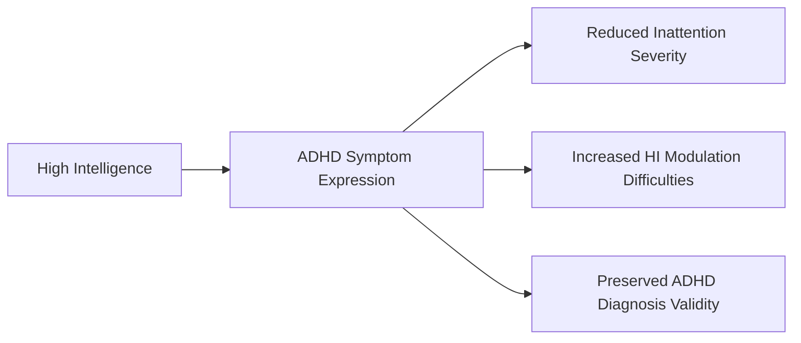

# ADHD Symptom Differences in Gifted Children

## Definition

The systematic differences in ADHD symptom manifestation between gifted and non-gifted children with ADHD, particularly affecting inattention severity and specific hyperactivity/impulsivity patterns.

## Core Mechanism

Gifted children with ADHD exhibit distinct symptom profiles compared to their non-gifted counterparts, suggesting that high intelligence moderates the expression of ADHD symptoms rather than eliminating them.

## Key Components

### 1. Inattention Severity Differences

- **Non-gifted ADHD**: Higher inattention scores (35.07 vs 31.44)
- **Gifted ADHD**: Lower inattention severity but still clinically significant
- **Implication**: Gifted children may compensate better for attention deficits

### 2. Hyperactivity/Impulsivity Modulation Patterns

Three specific HI symptoms are more pronounced in gifted/ADHD children:

| Symptom | Description | Clinical Significance |
|---------|-------------|---------------------|
| **Motor Modulation** | Difficulty controlling physical activity | May manifest as restlessness rather than hyperactivity |
| **Verbal Modulation** | Difficulty regulating speech | May present as excessive talking or interrupting |
| **Reflection** | Difficulty processing questions before responding | Suggests cognitive processing differences |

### 3. Diagnostic Validity

- **ADHD diagnosis remains valid** among gifted children
- **Symptom patterns differ** but core impairment persists
- **Treatment response** likely similar to non-gifted ADHD population

## Why It Matters

### Clinical Practice
- **Prevents misdiagnosis**: High intelligence doesn't rule out ADHD
- **Guides assessment**: Focus on specific HI symptoms in gifted populations
- **Informs treatment**: Understanding symptom differences affects intervention approaches

### Research Implications
- **Challenges assumptions**: Giftedness doesn't eliminate ADHD symptoms
- **Refines diagnostic criteria**: May need lower thresholds for HI symptoms in gifted children
- **Supports differential diagnosis**: Distinguishes ADHD from gifted-related behaviors

### Educational Settings
- **Identification**: Helps identify gifted children who may be overlooked for ADHD assessment
- **Intervention**: Tailored approaches for gifted children with ADHD
- **Accommodations**: Understanding specific challenges leads to better support

## Current State

The research provides empirical support for ADHD diagnosis in gifted children but suggests need for:
- Larger studies with gifted populations
- Development of gifted-specific assessment tools
- Investigation of how intelligence affects ADHD treatment response

## Open Questions

1. **Do gifted children with ADHD respond differently to standard treatments?**
2. **What cognitive mechanisms underlie the reduced inattention severity?**
3. **How do these differences manifest across different age groups?**
4. **What are the long-term outcomes for gifted children with ADHD?**

## Common Misconceptions

**Myth**: Gifted children cannot have ADHD because their intelligence compensates for symptoms  
**Reality**: ADHD diagnosis is valid among gifted children, though symptom patterns differ

**Myth**: ADHD symptoms in gifted children are always due to giftedness, not ADHD  
**Reality**: Specific HI symptoms indicate true ADHD impairment in gifted populations

**Myth**: Gifted children with ADHD have more severe symptoms (twice-exceptional concept)  
**Reality**: Most symptoms show similar severity, except for specific HI modulation difficulties

## History

This concept emerged from systematic research comparing ADHD symptoms across different intelligence levels, challenging historical assumptions about ADHD's validity in gifted populations.

## Related Concepts

- [[attention-deficit-hyperactivity-disorder]] — Core condition being differentiated
- [[twice-exceptional]] — Concept partially challenged by findings
- [[cognitive-reserve]] — Alternative theoretical framework
- [[intellectual-assessment]] — Methodological foundation
- [[differential-diagnosis]] — Clinical application area

## Sources

- ^[raw/articles/gifted-children-adhd-research.md] — Primary research study findings