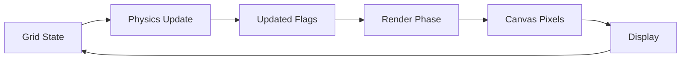
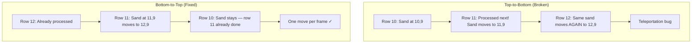

# Optimisation Techniques for Small-Scale Simulation

## Definition

Small-scale particle simulations — such as falling-sand games, cellular automata, and grid-based fluid dynamics — run on grids of 10,000–100,000 cells, updating every cell per frame at 30–60 FPS. The performance bottleneck is not computational complexity per cell (each cell does only a few comparisons), but sheer volume: 22,500 cells × 10+ operations × 60 frames/sec = millions of operations per second in a single-threaded JavaScript environment. Optimisation targets reducing per-cell overhead, eliminating redundant computation, and speeding up rendering.

## Core Mechanism

The simulation loop has two phases per frame:

1. **Physics update** — iterate all cells, apply rules (fall, flow, dissolve), modify grid state
2. **Render** — map grid state to pixels on an HTML5 Canvas

Both phases have independent optimisation strategies. The physics phase dominates when many particles are active; the render phase dominates when the grid is dense (every cell drawn).



## Key Components

### 1. Flat Typed Arrays Over Nested 2D Arrays

**Problem:** `grid[y][x]` requires two property lookups per access (array → sub-array → value). JavaScript engines can't optimise nested arrays as well as flat contiguous memory.

**Solution:** Use `Uint8Array` with index computation `grid[y * WIDTH + x]`.

| Aspect | Nested `[][]` | Flat `Uint8Array` |
|---|---|---|
| Memory layout | Scattered pointers | Contiguous bytes |
| Access pattern | 2 dereferences | 1 dereference + multiply |
| GC pressure | Many small arrays | Zero (pre-allocated) |
| `.fill()` reset | O(N²) loop | O(N) native call |

**Pseudo code:**
```
// Before (slow)
grid[y][x] = EMPTY           // two property lookups

// After (fast)
idx = y * WIDTH + x
grid[idx] = EMPTY             // one indexed write to contiguous buffer

// Helper function
function idx(x, y):
    return y * WIDTH + x
```

### 2. Single Grid with Updated-Flag Tracking

**Problem:** Dual-grid (read grid + write grid) causes race conditions. When multiple particles see the same empty cell in the read grid, they all write to that cell in the write grid — but only one value survives. The other particles vanish silently.

**Solution:** Single in-place grid with an `updated[]` flag array. When a particle moves from A→B, mark both `updated[A]` and `updated[B] = 1`. The main loop skips cells where `updated[i] = 1`, preventing double-processing.

```mermaid
graph TD
    subgraph "Dual Grid (Broken)"
        R1[Read Grid] --> P1[Particle A sees empty]
        R1 --> P2[Particle B sees same empty]
        P1 --> W1[Write Grid: B occupied]
        P2 --> W2[Write Grid: overwritten!]
        W2 --> V[Particle B vanishes]
    end
    subgraph "Single Grid + Updated (Fixed)"
        G[Grid] --> PA[Particle A moves to cell]
        PA --> U1[updated[A]=1, updated[target]=1]
        U1 --> PB[Particle B skips: updated[B]=1]
    end
```

**Pseudo code:**
```
function moveParticle(fromX, fromY, toX, toY, material):
    fi = idx(fromX, fromY)
    ti = idx(toX, toY)
    grid[fi] = EMPTY
    grid[ti] = material
    updated[fi] = 1      // mark source as processed
    updated[ti] = 1      // mark target as processed

function swapCells(x1, y1, x2, y2):
    i1 = idx(x1, y1)
    i2 = idx(x2, y2)
    temp = grid[i1]
    grid[i1] = grid[i2]
    grid[i2] = temp
    updated[i1] = 1
    updated[i2] = 1

// Main loop
updated.fill(0)              // reset all flags (O(N) native call)
for each cell (y from bottom, x randomised):
    if updated[idx] = 1: continue   // skip already-moved cells
    process cell
```

### 3. Uint32Array Rendering (Bulk Pixel Writes)

**Problem:** `ImageData.data` is a `Uint8ClampedArray` — writing RGBA requires 4 separate byte writes per pixel. For a 400×400 canvas with 150×150 grid cells (each cell ≈ 2.67×2.67 pixels), that's ~4,300 pixels × 4 writes = 17,200 byte writes per frame.

**Solution:** View the same buffer as `Uint32Array` — pack all 4 bytes into one 32-bit integer and write once. On little-endian systems (virtually all modern hardware), the byte order is ABGR.

| Approach | Writes per pixel | Total writes (full grid) |
|---|---|---|
| `Uint8ClampedArray` | 4 (R, G, B, A separately) | ~17,200 |
| `Uint32Array` | 1 (packed ABGR word) | ~4,300 |

**Pseudo code:**
```
function render():
    imageData = ctx.createImageData(canvasWidth, canvasHeight)
    buf32 = Uint32Array(imageData.data.buffer)  // same memory, 32-bit view
    
    for y in 0..GRID_HEIGHT:
        for x in 0..GRID_WIDTH:
            material = grid[idx(x, y)]
            // Pack RGBA into 32-bit word (little-endian: ABGR)
            pixel = (255 << 24) | (COLOR_B[material] << 16) 
                    | (COLOR_G[material] << 8) | COLOR_R[material]
            
            // Fill scaled cell area
            for py in startY..endY:
                rowStart = py * canvasWidth
                for px in startX..endX:
                    buf32[rowStart + px] = pixel    // ONE write, not four
```

### 4. Pre-Computed Lookup Tables

**Problem:** Storing colours as hex strings (`'#e9c46a'`) and parsing them per pixel with `parseInt(color.slice(1,3), 16)` does 3 string slices + 3 parseInt calls per cell per frame. For 22,500 cells: 67,500 parseInt calls per frame.

**Solution:** Pre-compute RGB arrays indexed by material type constant. Access is a direct array lookup — O(1), no string processing.

**Pseudo code:**
```
// Before (slow) — parse hex string every frame, every cell
COLORS = { SAND: '#e9c46a', WATER: '#4a9dc9', ... }
r = parseInt(color.slice(1, 3), 16)    // string slice + parseInt
g = parseInt(color.slice(3, 5), 16)
b = parseInt(color.slice(5, 7), 16)

// After (fast) — direct array index
COLOR_R = [30, 233, 74, 108, 0]   // indexed by material type (0=EMPTY, 1=SAND, ...)
COLOR_G = [30, 196, 157, 117, 255]
COLOR_B = [36, 106, 201, 125, 102]
r = COLOR_R[material]              // one array lookup, zero string ops
```

### 5. Eliminating Per-Frame Array Allocation

**Problem:** Randomising X processing order to prevent directional bias required creating a new array every row: `xOrder = [0,1,2,...,149]` or reverse. That's 150 array allocations per frame, each triggering GC.

**Solution:** Pre-allocate two arrays at init — `xOrderForward` and `xOrderReverse`. Choose between them per row with a single `Math.random() < 0.5` coin flip. Zero allocations per frame.

**Pseudo code:**
```
// Init (one-time)
xOrderForward = Uint8Array(WIDTH)   // [0, 1, 2, ..., 149]
xOrderReverse = Uint8Array(WIDTH)   // [149, 148, ..., 0]

// Per row (zero allocation)
xOrder = random() < 0.5 ? xOrderForward : xOrderReverse
for xi in 0..WIDTH:
    x = xOrder[xi]
    process(grid[idx(x, y)])
```

### 6. Inlining Diffusion into Physics Loop

**Problem:** The original diffusion implementation ran a separate `diffusionStep()` function 200 times per frame. Each call scanned the entire grid (22,500 cells) in randomised order looking for liquid pairs. Worst case: 200 × 22,500 = 4.5M cell reads per frame just for diffusion.

**Solution:** Check for diffusion during the main physics loop. When processing a liquid cell, pick one random neighbor and check if it's the opposite type. If so, swap with 90% probability. This costs ~1 neighbor check per liquid cell instead of a full grid scan.

| Approach | Cell reads per frame | Notes |
|---|---|---|
| Separate scan (200 iterations) | Up to 4,500,000 | Scans entire grid each iteration |
| Inline (during physics) | ~1 per liquid cell | Only checks cells already being visited |

**Pseudo code:**
```
// Inlined diffusion — checked during physics loop
if material == WATER or material == ACID:
    opposite = (material == WATER) ? ACID : WATER
    // Pick one random neighbor direction
    dir = randomDirection()  // one of 8 directions
    nx, ny = x + dir.dx, y + dir.dy
    if inBounds(nx, ny) and grid[idx(nx,ny)] == opposite 
       and not updated[idx(nx,ny)] and random() < 0.9:
        grid[idx(x,y)] = opposite
        grid[idx(nx,ny)] = material
        updated[idx(x,y)] = 1
        updated[idx(nx,ny)] = 1
        continue  // skip physics for this frame — cell already swapped
```

### 7. Lightweight Randomisation (Swap-2 vs Full Shuffle)

**Problem:** Acid's dissolve check shuffled all 6 neighbor offsets using Fisher-Yates, which is O(n) with multiple random calls and array mutations. For a common operation executed thousands of times per frame, this adds overhead.

**Solution:** Swap just 2 random elements in the fixed offsets array. This provides sufficient randomisation for dissolve targeting (acid doesn't need uniform distribution — it just needs to not always dissolve in the same direction) at minimal cost: 2 random calls + 1 swap.

**Pseudo code:**
```
// Before — full Fisher-Yates shuffle (O(n) random calls)
for i from n-1 down to 1:
    j = randomInt(0, i)
    swap(arr[i], arr[j])

// After — swap-2 randomisation (2 random calls)
si = randomInt(0, n)
sj = randomInt(0, n)
swap(arr[si], arr[sj])
```

### 8. Cached Particle Count

**Problem:** `countParticles()` scanned all 22,500 cells every second to update the UI display. Unnecessary work — we know exactly when particles are added or removed.

**Solution:** Maintain a running `particleCount` variable. Increment when painting adds a particle, decrement when acid dissolves (removes 2 particles). Zero-cost display update.

**Pseudo code:**
```
// Paint — add particle
if grid[idx] == EMPTY:
    grid[idx] = material
    particleCount++              // increment, not scan

// Acid dissolve — remove 2 particles
grid[target_idx] = EMPTY
grid[acid_idx] = EMPTY
particleCount -= 2               // decrement, not scan

// Display — just read the counter
document.getElementById('particles').textContent = particleCount
```

### 9. Bitwise Floor (`| 0` vs `Math.floor`)

**Problem:** `Math.floor()` is a function call with type coercion overhead. Used dozens of times per frame for coordinate calculations.

**Solution:** `value | 0` (bitwise OR with zero) truncates to integer identically for positive numbers, as a single CPU instruction with no function call.

**Pseudo code:**
```
// Before
startX = Math.floor(x * CELL_SIZE)
startY = Math.floor(y * CELL_SIZE)

// After
startX = x * CELL_SIZE | 0      // bitwise OR-zero: truncates to int32
startY = y * CELL_SIZE | 0
```

**Note:** Only works for positive values and values within 32-bit int range. For this simulation (grid coordinates 0–149, cell size ~2.67), all values are positive and small — safe to use.

### 10. Bottom-to-Top + Randomised X Processing Order

**Problem:** Top-to-bottom processing makes falling particles "teleport" — a sand grain at row 10 gets processed, moves to row 11, then row 11 gets processed next, so the same grain moves again to row 12 in one frame. Left-to-right X processing creates directional bias — left-side particles consistently get priority.

**Solution:** Process rows bottom-to-top (falling particles move to already-processed rows, preventing double-movement). Randomise X order per row (coin flip between forward and reverse) to eliminate directional bias.



**Pseudo code:**
```
// Bottom-to-top iteration
for y from GRID_HEIGHT-1 down to 0:
    // Randomise X direction per row
    xOrder = random() < 0.5 ? forward : reverse
    for xi in 0..GRID_WIDTH:
        x = xOrder[xi]
        i = y * WIDTH + x
        if updated[i]: continue
        process(grid[i])
```

## Why It Matters

Small-scale simulations are a common entry point for game development and interactive web projects. The techniques here are broadly applicable beyond sand games — any grid-based real-time computation (cellular automata, tilemap updates, heat diffusion, pathfinding on small grids) benefits from the same principles:

- **Memory layout matters more than algorithmic complexity** when N is small (10K–100K)
- **Eliminating allocations** prevents GC pauses that cause visible frame drops
- **Batch operations** (typed array views, `.fill()`) leverage hardware-level optimisations that loops can't match
- **Incremental tracking** (updated flags, cached counts) avoids redundant full-scans

## Current State

These techniques are mature and well-known in game development circles, but rarely documented together with concrete examples and measurable impact. The sand game simulation demonstrates that a vanilla JavaScript implementation on a 150×150 grid can run at interactive frame rates without WebGL, WASM, or frameworks — purely through data structure and algorithmic choices.

## Open Questions

- Can SIMD (WebAssembly SIMD) further accelerate the physics loop for batch cell comparisons?
- Is there a threshold where parallel processing (Web Workers) becomes worthwhile despite communication overhead?
- Could spatial hashing (only process non-empty cells) reduce iteration cost for sparse grids below 10% fill rate?

## Common Misconceptions

| Myth | Reality |
|---|---|
| "WebGL is needed for real-time simulation" | Canvas 2D + Uint32Array rendering handles 150×150 grids at 60 FPS in vanilla JS |
| "O(N²) algorithms are always slow" | When N=150, O(N²) is only 22,500 — fast enough if per-operation cost is low |
| "Dual grids prevent race conditions" | Dual grids CAUSE race conditions (multiple particles claim same cell); single grid + updated flags is safer |
| `Math.floor` is negligible overhead | Replacing it with `| 0` saves a function call per use — measurable in hot loops |
| Random shuffle must be Fisher-Yates | For per-cell randomisation (not cryptographic), swap-2 is sufficient and much cheaper |

## Related Concepts

- [[cellular-automata]] — Grid-based computation models where these optimisation techniques directly apply
- [[game-loop]] — The requestAnimationFrame-driven update-render cycle
- [[canvas-rendering]] — HTML5 Canvas 2D API and ImageData manipulation patterns

## Sources

- ^[raw/articles/sand-game-simulation.md] — The sand game implementation that demonstrates all 10 techniques in practice
