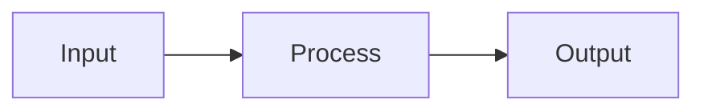

# Neural Nexus Setup Guide

Complete guide to building and maintaining Neural Nexus — a personal knowledge base with LLM Wiki structuring, Obsidian-style wikilinks, and free GitHub Pages hosting.

> **Focus:** Building the project infrastructure and maintaining it over time. Graph visualization is kept functional but simple — it works, it won't break, but it's not the priority.

---

## Table of Contents

- [Prerequisites](#prerequisites)
- [Phase 1: Repository Setup](#phase-1-repository-setup)
- [Phase 2: Directory Structure](#phase-2-directory-structure)
- [Phase 3: Dependencies](#phase-3-dependencies)
- [Phase 4: MkDocs Configuration](#phase-4-mkdocs-configuration)
- [Phase 5: Core Files](#phase-5-core-files)
- [Phase 6: Build Scripts](#phase-6-build-scripts)
- [Phase 7: Graph Visualization](#phase-7-graph-visualization)
- [Phase 8: GitHub Actions CI/CD](#phase-8-github-actions-cicd)
- [Phase 9: Obsidian Integration](#phase-9-obsidian-integration)
- [Phase 10: Initial Content & Testing](#phase-10-initial-content--testing)
- [Phase 11: Hermes Agent Integration](#phase-11-hermes-agent-integration)
- [Maintenance Guide](#maintenance-guide)
- [Troubleshooting](#troubleshooting)

---

## Prerequisites

### Required
- **GitHub account** (free tier, public repo for free Pages)
- **Node.js 20+** (for graph builder script — uses built-in `fs`/`path` only, no npm deps needed at build time)
- **Python 3.11+** (for MkDocs)
- **Git** (for version control)
- **Hermes Agent** (for automated ingestion and curation)

### Optional
- **Obsidian** (for local graph editing — free)
- **GitHub CLI** (`gh`) (easier repo operations — can use web UI instead)

### Why this stack
| Component | Why | Cost |
|-----------|-----|------|
| MkDocs Material | Best static site generator for docs — search, theming, plugins, responsive | Free |
| GitHub Pages | Free hosting for public repos, automatic SSL, custom domain support | Free |
| D3.js | Interactive graph visualization, loaded via CDN | Free |
| Obsidian | Local vault editing, graph view, backlinks panel | Free |
| Hermes Agent | Automated ingestion, linting, deployment | Free |

---

## Phase 1: Repository Setup

### Step 1.1: Create GitHub Repository

**Option A — Web UI:**
1. Go to https://github.com/new
2. Repository name: `Neural-Nexus`
3. Description: "Personal knowledge base — LLM Wiki + Obsidian, hosted on GitHub Pages"
4. Set to **Public** (required for free GitHub Pages)
5. Initialize with: **README.md**, **.gitignore** (Python), **MIT License**
6. Click "Create repository"

**Option B — GitHub CLI:**
```bash
# Install gh if not present (Debian/Ubuntu)
type -p curl >/dev/null || sudo apt-get install curl -y
curl -fsSL https://cli.github.com/packages/githubcli-archive-keyring.gpg | sudo dd of=/usr/share/keyrings/githubcli-archive-keyring.gpg
echo "deb [arch=$(dpkg --print-architecture) signed-by=/usr/share/keyrings/githubcli-archive-keyring.gpg] https://cli.github.com/packages stable main" | sudo tee /etc/apt/sources.list.d/github-cli.list > /dev/null
sudo apt-get update && sudo apt-get install gh -y

# Authenticate
gh auth login

# Create and clone
gh repo create Neural-Nexus \
  --public \
  --description "Personal knowledge base — LLM Wiki + Obsidian, hosted on GitHub Pages" \
  --clone
cd Neural-Nexus
```

### Step 1.2: Clone Repository

```bash
cd ~
git clone https://github.com/YOUR_USERNAME/Neural-Nexus.git
cd Neural-Nexus
```

### Step 1.3: Configure Git (if not already done)

```bash
git config user.name "Your Name"
git config user.email "your.email@example.com"
```

---

## Phase 2: Directory Structure

### Step 2.1: Create Directories

```bash
cd ~/Neural-Nexus

mkdir -p docs/{raw/{articles,videos,chats,assets},concepts,entities,ideas,findings,readings,comparisons,references,templates,js,css,hooks}
mkdir -p scripts
mkdir -p overrides/partials
mkdir -p .github/workflows
```

### Step 2.2: Directory Purpose

```
Neural-Nexus/
├── docs/                    # MkDocs docs_dir + Obsidian vault root
│   ├── index.md             # Landing page (manual)
│   ├── SCHEMA.md            # Structure conventions + tag taxonomy (manual)
│   ├── index-catalog.md     # Auto-generated page catalog (by script)
│   ├── log.md               # Append-only action log (manual + script)
│   ├── graph.md             # Graph visualization page (manual)
│   ├── graph-data.json      # Auto-generated graph data (by script)
│   ├── tags.md              # Auto-generated tag index (by plugin)
│   ├── concepts/            # Technical concepts, theories, frameworks
│   ├── entities/            # People, organizations, tools, projects
│   ├── ideas/               # Raw thoughts, brainstorming (no threshold)
│   ├── findings/            # Processed insights from research
│   ├── readings/            # Summaries of books, papers, videos
│   ├── comparisons/         # Side-by-side analyses
│   ├── raw/                 # Layer 1: Immutable source material
│   │   ├── articles/        # Web articles, blog posts
│   │   ├── videos/          # Video transcripts
│   │   ├── chats/           # Chat logs, session exports
│   │   └── assets/          # Images, diagrams
│   ├── references/          # Reference pages (writing guide, setup guide, cheat sheets)
│   ├── templates/           # Page templates per content type
│   ├── js/                  # Client-side JavaScript
│   │   └── graph-render.js  # D3.js graph renderer
│   ├── css/                 # Custom CSS
│   │   └── custom.css       # Theme overrides
│   ├── hooks/               # MkDocs hooks
│   │   └── wikilinks.py     # [[wikilink]] → markdown link converter
│   └── .obsidian/           # Obsidian vault config (created in Phase 9)
├── scripts/                 # Build and maintenance scripts
│   ├── lib.js               # Shared utilities (imported by all scripts)
│   ├── build-graph.js       # Graph data builder (zero deps)
│   ├── generate-catalog.js  # Catalog generator (zero deps)
│   ├── lint-wiki.js         # Health checker (zero deps)
│   └── suggest-links.js     # Link discovery engine (zero deps)
├── overrides/               # MkDocs Material theme overrides
│   └── partials/
├── .github/workflows/       # CI/CD
│   └── deploy.yml           # Build + deploy to GitHub Pages
├── mkdocs.yml               # MkDocs configuration
├── requirements.txt         # Python dependencies
├── CHANGELOG.md             # Platform changelog (scripts, schema, config)
├── .gitignore
└── README.md
```

### Step 2.3: Create .gitignore

```bash
cat > .gitignore << 'EOF'
# Python
venv/
__pycache__/
*.pyc
.pytest_cache/

# MkDocs build output
site/

# Obsidian workspace state (keep config, ignore runtime)
docs/.obsidian/workspace.json
docs/.obsidian/workspace-mobile.json
docs/.obsidian/cache

# OS
.DS_Store
Thumbs.db

# Editor
*.swp
*.swo
.vscode/
.idea/
EOF
```

---

## Phase 3: Dependencies

### Step 3.1: Python Virtual Environment + MkDocs

```bash
cd ~/Neural-Nexus
python3 -m venv venv
source venv/bin/activate

pip install \
  mkdocs-material \
  mkdocs-awesome-pages-plugin \
  mkdocs-minify-plugin \
  mkdocs-tags-plugin \
  mkdocs-git-revision-date-localized-plugin

pip freeze > requirements.txt
```

**What each package does:**

| Package | Purpose |
|---------|---------|
| `mkdocs-material` | Material Design theme — search, dark mode, responsive, 40+ extensions |
| `mkdocs-awesome-pages-plugin` | Control navigation ordering via `.pages` files |
| `mkdocs-minify-plugin` | Minify HTML/CSS/JS output for faster loads |
| `mkdocs-tags-plugin` | Auto-generate tag index page from frontmatter `tags:` field |
| `mkdocs-git-revision-date-localized` | Show "last updated" date from git history — no manual `updated:` maintenance |

### Step 3.2: Node.js

Node.js is only needed for build scripts. The scripts use **only built-in modules** (`fs`, `path`) — no npm dependencies, no `package.json`, no `npm install` needed.

**Verify:**
```bash
node --version  # Should be 20+
```

### Step 3.3: Add Activation Helper

To avoid re-sourcing venv every session, add to `~/.bashrc` or `~/.zshrc`:

```bash
alias nexus='cd ~/Neural-Nexus && source venv/bin/activate'
```

---

## Phase 4: MkDocs Configuration

### Step 4.1: Create mkdocs.yml

```yaml
site_name: Neural Nexus
site_description: Personal knowledge base — LLM Wiki + Obsidian, hosted on GitHub Pages
site_author: YOUR_NAME
site_url: https://YOUR_USERNAME.github.io/Neural-Nexus

# Repository
repo_name: YOUR_USERNAME/Neural-Nexus
repo_url: https://github.com/YOUR_USERNAME/Neural-Nexus
edit_uri: edit/main/docs/

# Copyright
copyright: Copyright &copy; 2026 YOUR_NAME

# Theme
theme:
  name: material
  language: en
  features:
    - navigation.instant      # SPA-like page transitions
    - navigation.tracking     # URL changes with anchor
    - navigation.tabs         # Top-level tabs
    - navigation.sections     # Group pages in sidebar
    - navigation.expand       # Expand all sections by default
    - navigation.top          # "Back to top" button
    - navigation.indexes      # Section index pages
    - search.suggest          # Search autocomplete
    - search.highlight        # Highlight search terms
    - search.share            # Shareable search links
    - toc.follow              # TOC tracks scroll position
    - content.code.copy       # Copy button on code blocks
    - content.code.annotate   # Code annotations
    - content.tabs.link       # Synced tabs
  palette:
    - media: "(prefers-color-scheme: light)"
      scheme: default
      primary: deep purple
      accent: indigo
      toggle:
        icon: material/brightness-7
        name: Switch to dark mode
    - media: "(prefers-color-scheme: dark)"
      scheme: slate
      primary: deep purple
      accent: indigo
      toggle:
        icon: material/brightness-4
        name: Switch to light mode
  font:
    text: Inter
    code: JetBrains Mono
  icon:
    logo: material/brain

# Plugins
plugins:
  - search:
      lang: en
  - awesome-pages
  - tags:
      tags_file: tags.md
  - minify:
      minify_html: true
  - git-revision-date-localized:
      enable_creation_date: true
      type: date

# Hooks — server-side [[wikilink]] rendering
hooks:
  - docs/hooks/wikilinks.py

# Extensions
markdown_extensions:
  - pymdownx.highlight:
      anchor_linenums: true
      line_spans: __span
      pygments_lang_class: true
  - pymdownx.inlinehilite
  - pymdownx.snippets
  - pymdownx.superfences:
      custom_fences:
        - name: mermaid
          class: mermaid
          format: !!python/name:pymdownx.superfences.fence_code_format
  - pymdownx.tabbed:
      alternate_style: true
  - pymdownx.mark
  - pymdownx.tilde
  - admonition
  - pymdownx.details
  - attr_list
  - md_in_html
  - tables
  - def_list
  - footnotes
  - toc:
      permalink: true
      toc_depth: 3

# Extra
extra:
  social:
    - icon: fontawesome/brands/github
      link: https://github.com/YOUR_USERNAME/Neural-Nexus
  generator: false

extra_css:
  - css/custom.css

extra_javascript:
  - https://d3js.org/d3.v7.min.js
  - js/graph-render.js

# Navigation (awesome-pages plugin can override per-section)
nav:
  - Home: index.md
  - Knowledge Graph: graph.md
  - Concepts: concepts/
  - Entities: entities/
  - Ideas: ideas/
  - Findings: findings/
  - Readings: readings/
  - Comparisons: comparisons/
  - References: references/
  - Raw Sources: raw/
  - Tags: tags.md
  - Schema: SCHEMA.md
  - Log: log.md
```

### Step 4.2: Create Wikilinks Hook

This is the **critical piece** that makes `[[wikilinks]]` work in MkDocs. It runs server-side during build — no client-side JS hacks, no broken links, works with search and sitemap.

**File: `docs/hooks/wikilinks.py`**

```python
"""
MkDocs hook: converts Obsidian-style [[wikilinks]] to proper Markdown links.

Supports:
  [[page-name]]           → [page-name](resolved/path.md)
  [[page-name|display]]   → [display](resolved/path.md)
  [[page-name#header]]    → [page-name#header](resolved/path.md#header)

Resolution:
  1. Exact slug match (full relative path without .md)
  2. Basename match (filename without extension)
  3. Case-insensitive basename match
  4. If unresolved, leaves [[link]] as-is (lint will flag it)
"""

import re
import os

# Global file map: slug → src_path
_file_map = {}


def on_files(files, config):
    """Build a lookup map of all page slugs → MkDocs source paths."""
    global _file_map
    _file_map = {}
    for f in files.src_paths.values():
        src_path = f.src_path
        # Map: full slug (e.g., "concepts/transformer-architecture")
        slug = src_path.replace('.md', '')
        _file_map[slug] = src_path
        # Map: basename only (e.g., "transformer-architecture")
        basename = os.path.splitext(os.path.basename(src_path))[0]
        if basename not in _file_map:
            _file_map[basename] = src_path
        # Map: lowercase basename for case-insensitive matching
        _file_map[basename.lower()] = src_path
    return files


def on_page_markdown(markdown, page, config, files):
    """Replace [[wikilinks]] with resolved Markdown links."""

    def replace_wikilink(match):
        target = match.group(1).strip()
        display = (match.group(2) or target).strip()

        # Split anchor
        if '#' in target:
            target_slug, anchor = target.split('#', 1)
            anchor = '#' + anchor
        else:
            target_slug = target
            anchor = ''

        # Skip external links
        if target_slug.startswith('http'):
            return match.group(0)

        # Resolve: try exact, then basename, then lowercase
        resolved = (
            _file_map.get(target_slug)
            or _file_map.get(os.path.basename(target_slug))
            or _file_map.get(target_slug.lower())
            or _file_map.get(os.path.basename(target_slug).lower())
        )

        if resolved:
            # Calculate relative path from current page to target
            return f'[{display}]({resolved}{anchor})'

        # Unresolved — leave as-is, lint will catch it
        return match.group(0)

    pattern = r'\[\[([^\]|]+)(?:\|([^\]]+))?\]\]'
    return re.sub(pattern, replace_wikilink, markdown)
```

### Step 4.3: Create Custom CSS

**File: `docs/css/custom.css`**

```css
/* Reading comfort — cap content width */
.md-content__inner {
  max-width: 900px;
}

/* Graph container */
#knowledge-graph {
  width: 100%;
  height: 600px;
  border: 1px solid var(--md-default-fg-color--lightest);
  border-radius: 8px;
  overflow: hidden;
  background: var(--md-default-bg-color);
}

/* Graph legend */
.graph-legend {
  display: flex;
  gap: 1rem;
  flex-wrap: wrap;
  margin: 1rem 0;
  font-size: 0.8rem;
}
.graph-legend span {
  display: flex;
  align-items: center;
  gap: 0.3rem;
}
.graph-legend span::before {
  content: '';
  width: 12px;
  height: 12px;
  border-radius: 50%;
  background: currentColor;
}

/* Tag badges */
.md-tag {
  font-size: 0.65rem;
}
```

### Step 4.4: Create .pages Files

The `awesome-pages` plugin uses `.pages` files to control navigation ordering. Create one in each content directory.

**File: `docs/concepts/.pages`**
```yaml
nav:
  - ...
```
(Empty `...` means "include all, sorted alphabetically".)

Repeat for `entities/`, `ideas/`, `findings/`, `readings/`, `comparisons/`, `references/`, `raw/` — create a `.pages` file in each with the same content.

```bash
for dir in concepts entities ideas findings readings comparisons references raw; do
  echo 'nav:
  - ...' > "docs/$dir/.pages"
done
```

---

## Phase 5: Core Files

### Step 5.1: Create SCHEMA.md

**File: `docs/SCHEMA.md`**

```markdown
# Neural Nexus Schema

## Domain
Multi-domain knowledge base: AI/ML, biotechnology, finance, psychology, devops, personal notes.

## Conventions
- **File names**: lowercase, hyphens, no spaces (e.g., `transformer-architecture.md`)
- **Frontmatter**: Every page must have YAML frontmatter (see below)
- **Wikilinks**: Use `[[page-name]]` for internal links (Obsidian-style)
  - Internal page: `[[page-name]]`
  - Link to header: `[[page-name#Header]]`
  - Custom text: `[[page-name|display text]]`
  - External URL: `[text](https://example.com/)`
  - Minimum 2 outbound `[[wikilinks]]` per page
- **Citations**: All pages derived from external material MUST cite sources
  - Frontmatter `sources:` field: list raw source files (e.g., `sources: [raw/articles/source.md]`)
  - Inline provenance: `^[raw/articles/source.md]` at paragraph level for specific claims
  - Readings and findings: MUST have sources (lint error if missing)
  - Concepts, entities, comparisons: SHOULD have sources when derived from material (lint warning)
  - Ideas: sources optional (original thoughts)
  - External URLs in prose should be captured to `raw/` and cited, not left as bare links
- **Updates**: Always bump the `updated` date when modifying page content
- **Catalog**: Every new page is added to `index-catalog.md` by `scripts/generate-catalog.js`
- **Log**: Append every action to `log.md`
- **Raw sources**: Never modify files in `raw/` — they are immutable. Corrections go in wiki pages.

## Frontmatter Template

` ```yaml `
---
title: Page Title
created: 2026-07-18
updated: 2026-07-18
type: entity | concept | idea | finding | reading | comparison
domain: ai | biotech | finance | devops | psychology | general
tags: [tag1, tag2]
sources: [raw/articles/source-name.md]
confidence: high | medium | low
status: draft | active | archived
backlinks: []  # auto-computed by build-graph.js, do not edit manually
---
` ``` `

### Raw Source Frontmatter

` ```yaml `
---
source_url: https://example.com/article
source_type: article | video | chat | file
ingested: 2026-07-18
sha256: <hex digest of body content below frontmatter>
---
` ``` `

The `sha256:` enables change detection on re-ingest. Skip processing if identical, flag drift if changed.

## Tag Taxonomy

Tags must come from this taxonomy. Add new tags here first, then use them.

### Domains
- ai, ml, llm, deep-learning, nlp, computer-vision
- biotech, genomics, dna, nanotechnology, synthetic-biology
- finance, trading, economics, cryptocurrency, risk-management
- devops, infrastructure, security, reliability, monitoring
- psychology, neuroscience, cognitive-science, behavior
- hermes, automation, workflow, knowledge-management

### Topics
**AI/ML**: architecture, training, inference, alignment, safety, evaluation, fine-tuning
**Biotech**: sequencing, crispr, protein-design, drug-discovery
**Finance**: markets, portfolio, analysis, algorithmic-trading
**DevOps**: kubernetes, ci-cd, observability, site-reliability
**Psychology**: learning, decision-making, therapy, cognitive-bias

### Meta
- research, opinion, tutorial, reference, news, analysis, comparison

## Content Types

### Ideas
- **Purpose**: Raw thoughts, brainstorming, unprocessed notes
- **Threshold**: No minimum — create for any thought worth keeping
- **Structure**: Quick bullets, minimal structure
- **Example**: "Idea for optimizing RAG retrieval with hierarchical clustering"

### Findings
- **Purpose**: Processed insights from research/analysis
- **Threshold**: Create when processing reveals novel insight
- **Structure**: Problem → Analysis → Conclusion → Sources
- **Example**: "Video analysis revealed 3 key patterns in agent workflows"

### Readings
- **Purpose**: Summaries of books, papers, videos
- **Threshold**: Create one for every ingested source
- **Structure**: Title, source, key points, quotes, related pages
- **Example**: "LLM Wiki video notes with 5 key takeaways"

### Entities
- **Purpose**: People, organizations, tools, projects
- **Threshold**: Mentioned in 2+ sources OR central to 1 source
- **Structure**: Overview, key facts, relationships, sources
- **Example**: "Andrej Karpathy — AI researcher, former Tesla Autopilot director"

### Concepts
- **Purpose**: Technical concepts, theories, frameworks
- **Threshold**: Explained in depth OR appears in 3+ sources
- **Structure**: Definition, current state, open questions, related concepts
- **Example**: "Transformer architecture — self-attention, multi-head, positional encoding"

### Comparisons
- **Purpose**: Side-by-side analyses
- **Threshold**: Whenever comparing 2+ items
- **Structure**: What compared, dimensions, verdict, sources
- **Example**: "Obsidian vs Notion vs Roam Research"

## Page Creation Rules

1. **Ideas**: No minimum threshold — create freely
2. **Readings**: One per source — always create
3. **Entities**: 2+ source mentions OR central to 1 source
4. **Concepts**: Deep explanation OR 3+ source appearances
5. **Findings**: Novel insight from processing
6. **Comparisons**: When analyzing 2+ items

## Update Policy

When new information conflicts with existing content:
1. Check dates — newer sources generally supersede older ones
2. If genuinely contradictory, note both positions with dates and sources
3. Mark in frontmatter: `contradictions: [page-name]`
4. Flag for user review during lint

## Quality Signals

- **confidence**: high (well-supported across sources), medium (some support), low (single source or opinion)
- **contested**: true when unresolved contradictions exist
- **status**: draft (new/unpolished), active (stable), archived (superseded)

## Page Size
- **Target**: 50–150 lines per page
- **Split**: When exceeding 200 lines — break into sub-topics with cross-links
- **Archive**: Move to `_archive/` when fully superseded
```

### Step 5.2: Create index.md

**File: `docs/index.md`**

```markdown
# Neural Nexus

> Your second brain — personal knowledge base powered by LLM Wiki + Obsidian

## What is Neural Nexus?

A personal knowledge base combining:
- **LLM Wiki's** semantic knowledge structuring
- **Obsidian's** wikilink-based navigation
- **MkDocs Material** for searchable, responsive web interface
- **GitHub Pages** for free hosting
- **Hermes Agent** for automated ingestion and curation

## Browse by Type

| Type | Description |
|------|-------------|
| [Concepts](concepts/) | Technical concepts, theories, frameworks |
| [Entities](entities/) | People, organizations, tools, projects |
| [Ideas](ideas/) | Raw thoughts, brainstorming |
| [Findings](findings/) | Processed insights from research |
| [Readings](readings/) | Summaries of books, papers, videos |
| [Comparisons](comparisons/) | Side-by-side analyses |

## Explore

- [Knowledge Graph](graph.md) — visualize connections
- [Tags](tags.md) — browse by tag
- [Schema](SCHEMA.md) — structure conventions
- [Log](log.md) — recent activity

## Add Content

Send URLs, videos, or notes to Hermes Agent:
- "Add this URL to Neural Nexus: https://example.com/article"
- "Process this video: https://youtube.com/watch?v=xxx"
- "Create an idea page for: [your thought]"
- "Dump this finding: [your analysis]"
```

### Step 5.3: Create log.md

**File: `docs/log.md`**

```markdown
# Neural Nexus Log

> Chronological record of all wiki actions. Append-only.
> Format: `## [YYYY-MM-DD] action | subject`
> Actions: create, ingest, update, query, lint, deploy, archive

## [2026-07-18] create | Wiki initialized
- Domain: Multi-domain (AI, biotech, finance, psychology, devops, personal)
- Structure: SCHEMA.md, index.md, log.md, 6 content type directories
- Technology: MkDocs Material + D3.js graph + GitHub Pages
- Automation: Hermes Agent integration planned
```

### Step 5.4: Create index-catalog.md

This file is auto-generated by `scripts/generate-catalog.js`. Create the initial version:

**File: `docs/index-catalog.md`**

```markdown
# Index Catalog

> Complete catalog of all wiki pages. Auto-generated by `scripts/generate-catalog.js`.
> Last updated: 2026-07-18 | Total pages: 0

## Concepts
*No pages yet*

## Entities
*No pages yet*

## Ideas
*No pages yet*

## Findings
*No pages yet*

## Readings
*No pages yet*

## Comparisons
*No pages yet*
```

### Step 5.5: Create Page Templates

One template per content type, plus a writing guide. These speed up page creation and ensure consistency. Copy these from the `neural-nexus` skill's `templates/` directory, or create them inline.

The templates below are the **recommended structure** for each content type — designed to produce high-quality, well-linked, consistently formatted pages. Each template has:
- Complete frontmatter with sensible defaults
- Section headers with HTML comments guiding what to write
- Minimum 2 wikilink placeholders

**File: `docs/templates/idea-template.md`**
```markdown
---
title: 
created: {{date}}
updated: {{date}}
type: idea
domain: 
tags: []
sources: []
confidence: low
status: draft
---

# {{title}}

## Thought

<!-- State the idea in 1-3 sentences. Don't overthink it. -->

## Context

<!-- What prompted this? A reading, a conversation, a shower thought? Link the source if applicable. -->

- 

## Why It's Interesting

<!-- What makes this worth keeping? What problem could it solve? What could it lead to? -->

- 

## Potential Next Steps

<!-- Optional. If this idea becomes something, what's the first step? -->

- [ ] 

## Related

- [[]]
- [[]]
```

**File: `docs/templates/finding-template.md`**
```markdown
---
title: 
created: {{date}}
updated: {{date}}
type: finding
domain: 
tags: []
sources: []
confidence: medium
status: draft
---

# {{title}}

## Question

<!-- What question or problem does this finding address? Frame it as a question. -->

## Evidence

<!-- The data, observations, or reasoning that supports this finding. Cite sources inline. -->

- **Source 1**: [observation or quote] ^[raw/articles/source-file.md]
- **Source 2**: [observation or quote] ^[raw/videos/source-file.md]

## Analysis

<!-- Connect the evidence. How do the pieces fit together? What's the reasoning chain? -->

1. 
2. 
3. 

## Conclusion

<!-- The finding stated directly. 1-3 sentences. This is what someone should remember. -->

## Limitations

<!-- What could be wrong? What's missing? What would change this conclusion? -->

- 

## Related

- [[]]
- [[]]
```

**File: `docs/templates/reading-template.md`**
```markdown
---
title: 
created: {{date}}
updated: {{date}}
type: reading
domain: 
tags: []
sources: [raw/]
confidence: high
status: active
---

# {{title}}

## Source

| Field | Value |
|-------|-------|
| Type | article \| video \| paper \| book \| podcast |
| URL | |
| Author | |
| Published | |
| Ingested | {{date}} |

## TL;DR

<!-- 2-3 sentence summary. What's the one thing to take away? -->

## Key Points

1. 
2. 
3. 
4. 
5. 

## Notable Quotes

> <!-- Quote 1 — with context if needed -->

> <!-- Quote 2 -->

## Detailed Notes

### Section 1

<!-- Structured notes by section or topic. Not a transcript — distilled. -->

### Section 2

## Entities Mentioned

<!-- People, orgs, tools, projects. Link to entity pages if they exist, otherwise just name them. -->

- [[entity-name]] — who/what, role in this source
- 

## Concepts Referenced

<!-- Technical concepts, theories, frameworks. Link to concept pages if they exist. -->

- [[concept-name]] — how it's used in this source
- 

## My Takeaways

<!-- Your personal interpretation. What does this mean for your work/interests? Separate from what the author said. -->

- 

## Related Readings

- [[]]
- [[]]
```

**File: `docs/templates/entity-template.md`**
```markdown
---
title: 
created: {{date}}
updated: {{date}}
type: entity
domain: 
tags: []
sources: []
confidence: medium
status: active
---

# {{title}}

## Overview

<!-- One paragraph. Who/what is this? Why does it matter? The elevator pitch. -->

## Key Facts

<!-- Bullet list of concrete facts: dates, numbers, locations, roles. No fluff. -->

- **Founded / Born**: 
- **Location**: 
- **Known for**: 
- **Role**: 
- **Notable work**: 

## Relationships

<!-- How does this entity connect to others? Use wikilinks. -->

- **Collaborator / Colleague**: [[]]
- **Competitor / Rival**: [[]]
- **Part of**: [[]]
- **Created / Founded**: [[]]

## Timeline

<!-- Optional. Key milestones in chronological order. Only include if the entity has a meaningful history. -->

| Date | Event |
|------|-------|
| | |
| | |

## In This Wiki

<!-- Which readings, findings, or concepts reference this entity? This helps surface cross-connections. -->

- Referenced in: [[]]
- Central to: [[]]
- Related concept: [[]]

## Sources

- ^[raw/articles/source-file.md]
- ^[raw/videos/source-file.md]

## Related

- [[]]
- [[]]
```

**File: `docs/templates/concept-template.md`**
```markdown
---
title: 
created: {{date}}
updated: {{date}}
type: concept
domain: 
tags: []
sources: []
confidence: medium
status: active
---

# {{title}}

## Definition

<!-- 2-4 sentences. What is this concept? Define it clearly for someone who's never heard of it. Avoid jargon in the definition — explain jargon when you introduce it later. -->

## Core Mechanism

<!-- How does it work? What are the moving parts? Use a diagram or equation if helpful.


-->

## Key Components

<!-- Break down the concept into its parts. One subsection per component. -->

### Component 1

### Component 2

### Component 3

## Why It Matters

<!-- What problem does this solve? What changed because of it? Why do people care? -->

## Current State

<!-- Where is this concept today? Mature? Emerging? Contested? What's the frontier? -->

## Open Questions

<!-- What's unresolved or debated? What don't we know yet? -->

- 
- 

## Common Misconceptions

<!-- Optional. What do people get wrong about this? -->

- **Myth**: 
  **Reality**: 

## History

<!-- Optional. Brief origin — who introduced it, when, in what context. -->

## Related Concepts

- [[]] — <!-- how it relates -->
- [[]] — <!-- how it relates -->

## Sources

- ^[raw/articles/source-file.md]
- ^[raw/videos/source-file.md]
```

**File: `docs/templates/comparison-template.md`**
```markdown
---
title: 
created: {{date}}
updated: {{date}}
type: comparison
domain: 
tags: [comparison]
sources: []
confidence: medium
status: active
---

# {{title}}

## What's Being Compared

| Item | Type | Origin | Key Claim |
|------|------|--------|-----------|
| [[item-a]] | | | |
| [[item-b]] | | | |

## Why Compare These

<!-- What question motivates this comparison? What decision does it inform? -->

## Comparison Matrix

| Dimension | [[item-a]] | [[item-b]] | Winner |
|-----------|------------|------------|--------|
| **Cost** | | | |
| **Performance** | | | |
| **Ease of Use** | | | |
| **Flexibility** | | | |
| **Community / Support** | | | |
| **Longevity** | | | |
| **Customization** | | | |

## Detailed Analysis

### Dimension 1: <!-- Cost / Performance / etc. -->

<!-- Deep dive on one dimension. Evidence, examples, trade-offs. -->

### Dimension 2: 

### Dimension 3: 

## Context-Dependent Verdict

<!-- Rarely is one option always better. Break down by use case. -->

| Use Case | Best Choice | Why |
|----------|-------------|-----|
| | | |
| | | |

## Summary

<!-- 2-3 sentences. The TL;DR verdict. -->

## Sources

- ^[raw/articles/source-file.md]
- ^[raw/articles/source-file-2.md]

## Related

- [[]]
- [[]]
```

### Step 5.6: Create Writing Guide

The writing guide teaches **how to write good wiki pages** — not just the structure (templates), but the craft. It covers:

- Core principles (synthesis not storage, atomic focus, link before explain)
- Frontmatter cheat sheet (required fields, confidence levels, status lifecycle)
- Wikilink conventions (syntax, rules, what to link)
- Per-content-type guidelines (structure, thresholds, common mistakes)
- Provenance and citing sources (inline `^[raw/...]` markers)
- Writing process (ingest workflow, updating, splitting)
- Style guide (voice, formatting, naming, length targets)
- Quality checklist (10-point pre-save checklist)
- Examples (good concept + reading page excerpts)
- Anti-patterns (Storage Room, Island, Wall of Text, Stub, Clone, Phantom Linker)

**File: `docs/references/writing-guide.md`**

Copy from the `neural-nexus` skill:

```bash
cp ~/.hermes/skills/productivity/neural-nexus/templates/writing-guide.md \
   ~/Neural-Nexus/docs/references/writing-guide.md
```

This file is the reference for all wiki page authors — both human and agent. When in doubt about how to structure or write a page, consult the writing guide.

### Step 5.7: Copy Setup Guide into Repo

The complete setup guide (this document) should be published in the repo so it's accessible from the live GitHub Pages site.

```bash
cp ~/.hermes/skills/productivity/neural-nexus/templates/setup-guide.md \
   ~/Neural-Nexus/docs/references/setup-guide.md
```

### Step 5.8: Create CHANGELOG.md

The changelog tracks **platform** changes — updates to scripts, schema, templates, and configuration. This is separate from `docs/log.md`, which tracks **wiki content** operations (ingest, review, lint).

**File: `CHANGELOG.md`** (repo root)

Copy from the `neural-nexus` skill:

```bash
cp ~/.hermes/skills/productivity/neural-nexus/templates/CHANGELOG.md \
   ~/Neural-Nexus/CHANGELOG.md
```

**Two logs, two purposes:**

| File | Location | Tracks | Updated by |
|------|----------|--------|------------|
| `CHANGELOG.md` | Repo root | Platform changes (scripts, schema, config, templates) | When modifying platform tooling |
| `docs/log.md` | `docs/` | Wiki content operations (ingest, review, lint, deploy) | Every wiki operation |

**When to update CHANGELOG.md:**
- Added/changed/removed a script
- Modified SCHEMA.md (new tags, new content type, changed rules)
- Updated mkdocs.yml (new plugin, changed theme)
- Changed CI/CD workflow
- Updated templates
- Security fixes

**Format:**
```markdown
## [YYYY-MM-DD] — Category

### Added
- Description of what was added

### Changed
- Description of what changed

### Fixed
- Description of what was fixed
```

---

## Phase 6: Build Scripts

These three scripts are the maintenance backbone. They use **only Node.js built-in modules** — no npm dependencies, no `package.json`, no `npm install` needed in CI.

### Step 6.1: build-graph.js

Scans all `.md` files, extracts frontmatter + wikilinks, builds graph data JSON. Also computes backlinks.

**Key improvements over naive parsers:**
- Robust frontmatter parsing (handles colons in titles, inline arrays)
- Fuzzy wikilink resolution (exact match → basename → case-insensitive)
- Skips all `index.md` files (not just root)
- Computes inbound link count per node

**File: `scripts/build-graph.js`**

```javascript
#!/usr/bin/env node
'use strict';

const fs = require('fs');
const path = require('path');

const ROOT_DIR = path.join(__dirname, '..');
const DOCS_DIR = path.join(ROOT_DIR, 'docs');
const OUTPUT_FILE = path.join(DOCS_DIR, 'graph-data.json');

// Directories that contain wiki pages (not raw sources, not meta files)
const CONTENT_DIRS = ['concepts', 'entities', 'ideas', 'findings', 'readings', 'comparisons'];

// ── File scanning ─────────────────────────────────────────────

function getAllMarkdownFiles(dir) {
  const files = [];
  let items;
  try {
    items = fs.readdirSync(dir);
  } catch {
    return files;
  }

  for (const item of items) {
    if (item.startsWith('.') || item.startsWith('_')) continue;
    const fullPath = path.join(dir, item);
    const stat = fs.statSync(fullPath);

    if (stat.isDirectory()) {
      files.push(...getAllMarkdownFiles(fullPath));
    } else if (item.endsWith('.md') && item !== 'index.md' && item !== 'SCHEMA.md') {
      files.push(fullPath);
    }
  }
  return files;
}

// ── Frontmatter parsing ──────────────────────────────────────
// Handles: simple values, inline arrays [a, b], titles with colons

function parseFrontmatter(content) {
  const fmRegex = /^---\r?\n([\s\S]*?)\r?\n---/;
  const match = content.match(fmRegex);
  if (!match) return {};

  const fm = {};
  const lines = match[1].split('\n');

  for (const line of lines) {
    const trimmed = line.trim();
    if (!trimmed || trimmed.startsWith('#')) continue;

    const colonIdx = trimmed.indexOf(':');
    if (colonIdx === -1) continue;

    const key = trimmed.substring(0, colonIdx).trim();
    let value = trimmed.substring(colonIdx + 1).trim();

    // Strip surrounding quotes
    if ((value.startsWith('"') && value.endsWith('"')) ||
        (value.startsWith("'") && value.endsWith("'"))) {
      value = value.slice(1, -1);
    }

    // Parse inline array: [item1, item2, item3]
    if (value.startsWith('[') && value.endsWith(']')) {
      const inner = value.slice(1, -1).trim();
      fm[key] = inner ? inner.split(',').map(s => s.trim().replace(/^["']|["']$/g, '')) : [];
    } else {
      fm[key] = value;
    }
  }

  return fm;
}

// ── Wikilink extraction ──────────────────────────────────────

function extractWikilinks(content) {
  // Match [[target]] or [[target|display]] but not inside code blocks
  const links = [];
  const codeBlockRegex = /```[\s\S]*?```|`[^`]*`/g;
  const cleaned = content.replace(codeBlockRegex, ''); // Remove code blocks

  const wikilinkRegex = /\[\[([^\]|]+)(?:\|([^\]]+))?\]\]/g;
  let match;
  while ((match = wikilinkRegex.exec(cleaned)) !== null) {
    links.push(match[1].trim());
  }
  return links;
}

// ── Slug normalization ───────────────────────────────────────

function fileToSlug(filePath) {
  return path.relative(DOCS_DIR, filePath).replace(/\.md$/, '').replace(/\\/g, '/');
}

function normalizeWikilinkTarget(target) {
  // Remove anchors
  return target.split('#')[0].trim();
}

function resolveWikilink(target, slugToNode) {
  const clean = normalizeWikilinkTarget(target);
  if (!clean) return null;

  // 1. Exact match (e.g., "concepts/transformer-architecture")
  if (slugToNode[clean] !== undefined) return slugToNode[clean];

  // 2. Basename match (e.g., "transformer-architecture" → match "concepts/transformer-architecture")
  const basename = path.basename(clean);
  if (slugToNode[basename] !== undefined) return slugToNode[basename];

  // 3. Case-insensitive basename
  const lower = basename.toLowerCase();
  for (const [slug, id] of Object.entries(slugToNode)) {
    if (slug.toLowerCase().endsWith('/' + lower) || slug.toLowerCase() === lower) {
      return id;
    }
  }

  return null;
}

// ── Build graph ──────────────────────────────────────────────

function buildGraph() {
  const files = [];
  for (const dir of CONTENT_DIRS) {
    const dirPath = path.join(DOCS_DIR, dir);
    if (fs.existsSync(dirPath)) {
      files.push(...getAllMarkdownFiles(dirPath));
    }
  }
  // Also scan references/ and root for any wiki pages
  const refDir = path.join(DOCS_DIR, 'references');
  if (fs.existsSync(refDir)) {
    files.push(...getAllMarkdownFiles(refDir));
  }

  const nodes = [];
  const edges = [];
  const slugToId = {};

  // Create nodes
  for (const file of files) {
    const slug = fileToSlug(file);
    const content = fs.readFileSync(file, 'utf-8');
    const fm = parseFrontmatter(content);

    const id = nodes.length;
    slugToId[slug] = id;

    // Also map basename for fuzzy resolution
    const basename = path.basename(slug);
    if (slugToId[basename] === undefined) {
      slugToId[basename] = id;
    }

    nodes.push({
      id,
      slug,
      title: fm.title || slug,
      type: fm.type || 'unknown',
      domain: fm.domain || 'general',
      tags: Array.isArray(fm.tags) ? fm.tags : [],
      updated: fm.updated || '1970-01-01',
      url: '/' + slug + '/',
      inboundLinks: 0,
      outboundLinks: 0
    });
  }

  // Create edges from wikilinks
  for (const file of files) {
    const sourceSlug = fileToSlug(file);
    const content = fs.readFileSync(file, 'utf-8');
    const wikilinks = extractWikilinks(content);

    const sourceId = slugToId[sourceSlug];
    if (sourceId === undefined) continue;

    const seen = new Set(); // Avoid duplicate edges
    for (const link of wikilinks) {
      const targetId = resolveWikilink(link, slugToId);
      if (targetId !== null && targetId !== sourceId && !seen.has(targetId)) {
        seen.add(targetId);
        edges.push({ source: sourceId, target: targetId });
        nodes[sourceId].outboundLinks++;
        nodes[targetId].inboundLinks++;
      }
    }
  }

  const graphData = {
    nodes,
    edges,
    metadata: {
      totalNodes: nodes.length,
      totalEdges: edges.length,
      generatedAt: new Date().toISOString()
    }
  };

  fs.writeFileSync(OUTPUT_FILE, JSON.stringify(graphData, null, 2));

  console.log(`✓ Graph built: ${nodes.length} nodes, ${edges.length} edges`);
  console.log(`✓ Saved to: ${OUTPUT_FILE}`);

  // Report orphan pages (zero inbound + zero outbound links)
  const orphans = nodes.filter(n => n.inboundLinks === 0 && n.outboundLinks === 0);
  if (orphans.length > 0) {
    console.log(`⚠  ${orphans.length} orphan page(s):`);
    orphans.forEach(n => console.log(`   - ${n.slug}`));
  }

  return graphData;
}

buildGraph();
```

### Step 6.2: generate-catalog.js

Auto-generates `index-catalog.md` from all wiki pages.

**File: `scripts/generate-catalog.js`**

```javascript
#!/usr/bin/env node
'use strict';

const fs = require('fs');
const path = require('path');

const ROOT_DIR = path.join(__dirname, '..');
const DOCS_DIR = path.join(ROOT_DIR, 'docs');
const OUTPUT_FILE = path.join(DOCS_DIR, 'index-catalog.md');

const SECTIONS = [
  { dir: 'concepts', label: 'Concepts' },
  { dir: 'entities', label: 'Entities' },
  { dir: 'ideas', label: 'Ideas' },
  { dir: 'findings', label: 'Findings' },
  { dir: 'readings', label: 'Readings' },
  { dir: 'comparisons', label: 'Comparisons' },
];

// Reuse the same frontmatter parser
function parseFrontmatter(content) {
  const fmRegex = /^---\r?\n([\s\S]*?)\r?\n---/;
  const match = content.match(fmRegex);
  if (!match) return {};
  const fm = {};
  for (const line of match[1].split('\n')) {
    const trimmed = line.trim();
    if (!trimmed || trimmed.startsWith('#')) continue;
    const colonIdx = trimmed.indexOf(':');
    if (colonIdx === -1) continue;
    const key = trimmed.substring(0, colonIdx).trim();
    let value = trimmed.substring(colonIdx + 1).trim();
    if ((value.startsWith('"') && value.endsWith('"')) ||
        (value.startsWith("'") && value.endsWith("'"))) {
      value = value.slice(1, -1);
    }
    if (value.startsWith('[') && value.endsWith(']')) {
      const inner = value.slice(1, -1).trim();
      fm[key] = inner ? inner.split(',').map(s => s.trim().replace(/^["']|["']$/g, '')) : [];
    } else {
      fm[key] = value;
    }
  }
  return fm;
}

function getPages(dirPath) {
  let files = [];
  try {
    files = fs.readdirSync(dirPath).filter(f => f.endsWith('.md') && f !== 'index.md');
  } catch {
    return [];
  }

  return files.map(file => {
    const fullPath = path.join(dirPath, file);
    const content = fs.readFileSync(fullPath, 'utf-8');
    const fm = parseFrontmatter(content);
    return {
      filename: file,
      slug: file.replace(/\.md$/, ''),
      title: fm.title || file.replace(/\.md$/, ''),
      domain: fm.domain || 'general',
      tags: Array.isArray(fm.tags) ? fm.tags : [],
      updated: fm.updated || '1970-01-01',
      status: fm.status || 'active'
    };
  }).sort((a, b) => a.title.localeCompare(b.title));
}

function generate() {
  let total = 0;
  let output = '# Index Catalog\n\n';
  output += '> Complete catalog of all wiki pages. Auto-generated by `scripts/generate-catalog.js`.\n';
  output += `> Last updated: ${new Date().toISOString().split('T')[0]} | Total pages: `;

  const sectionData = [];
  for (const section of SECTIONS) {
    const dirPath = path.join(DOCS_DIR, section.dir);
    const pages = getPages(dirPath);
    sectionData.push({ section, pages });
    total += pages.length;
  }

  output += `${total}\n\n`;

  for (const { section, pages } of sectionData) {
    output += `## ${section.label}\n\n`;
    if (pages.length === 0) {
      output += '*No pages yet*\n\n';
    } else {
      for (const page of pages) {
        output += `- [[${page.slug}]] — ${page.domain}`;
        if (page.tags.length > 0) {
          output += ` · \`${page.tags.join('`, `')}\``;
        }
        if (page.status === 'draft') {
          output += ` · *draft*`;
        }
        output += '\n';
      }
      output += '\n';
    }
  }

  fs.writeFileSync(OUTPUT_FILE, output);
  console.log(`✓ Catalog generated: ${total} pages across ${SECTIONS.length} sections`);
  console.log(`✓ Saved to: ${OUTPUT_FILE}`);
}

generate();
```

### Step 6.3: lint-wiki.js

Health checker — finds orphans, broken links, missing frontmatter, stale content, tag violations, **enforces citations**, and **actively discovers missing links** between pages.

**Citation enforcement** (lint errors/warnings by type):
- Readings without sources → **error** (it's a summary OF a source)
- Findings without sources → **error** (evidence-based)
- Concepts/entities/comparisons without sources → **warning**
- Inline `^[raw/...]` pointing to missing files → **warning**
- Frontmatter `sources:` listing missing files → **warning**
- External URLs in prose with no raw source captured → **info**

**Active link discovery** (built into lint, also available standalone):
1. **Text mentions**: Page A mentions Page B's title in prose but doesn't link it
2. **Shared sources**: Pages citing the same raw source but not cross-linked
3. **Tag overlap**: Same domain + 2+ shared tags, no link between them

This is what makes the wiki compound over time — the maintenance tooling doesn't just catch errors, it actively finds connections that should exist but don't.

**File: `scripts/lint-wiki.js`**

```javascript
#!/usr/bin/env node
'use strict';

const fs = require('fs');
const path = require('path');

const ROOT_DIR = path.join(__dirname, '..');
const DOCS_DIR = path.join(ROOT_DIR, 'docs');

const CONTENT_DIRS = ['concepts', 'entities', 'ideas', 'findings', 'readings', 'comparisons'];
const REQUIRED_FM_FIELDS = ['title', 'created', 'updated', 'type', 'domain', 'tags'];

// Valid tags from SCHEMA.md (keep in sync)
const VALID_TAGS = new Set([
  // Domains
  'ai', 'ml', 'llm', 'deep-learning', 'nlp', 'computer-vision',
  'biotech', 'genomics', 'dna', 'nanotechnology', 'synthetic-biology',
  'finance', 'trading', 'economics', 'cryptocurrency', 'risk-management',
  'devops', 'infrastructure', 'security', 'reliability', 'monitoring',
  'psychology', 'neuroscience', 'cognitive-science', 'behavior',
  'hermes', 'automation', 'workflow', 'knowledge-management',
  // AI/ML topics
  'architecture', 'training', 'inference', 'alignment', 'safety', 'evaluation', 'fine-tuning',
  // Biotech topics
  'sequencing', 'crispr', 'protein-design', 'drug-discovery',
  // Finance topics
  'markets', 'portfolio', 'analysis', 'algorithmic-trading',
  // DevOps topics
  'kubernetes', 'ci-cd', 'observability', 'site-reliability',
  // Psychology topics
  'learning', 'decision-making', 'therapy', 'cognitive-bias',
  // Meta
  'research', 'opinion', 'tutorial', 'reference', 'news', 'analysis', 'comparison'
]);

const errors = [];
const warnings = [];
const info = [];

// ── Helpers ──────────────────────────────────────────────────

function parseFrontmatter(content) {
  const fmRegex = /^---\r?\n([\s\S]*?)\r?\n---/;
  const match = content.match(fmRegex);
  if (!match) return null;
  const fm = {};
  for (const line of match[1].split('\n')) {
    const trimmed = line.trim();
    if (!trimmed || trimmed.startsWith('#')) continue;
    const colonIdx = trimmed.indexOf(':');
    if (colonIdx === -1) continue;
    const key = trimmed.substring(0, colonIdx).trim();
    let value = trimmed.substring(colonIdx + 1).trim();
    if ((value.startsWith('"') && value.endsWith('"')) ||
        (value.startsWith("'") && value.endsWith("'"))) {
      value = value.slice(1, -1);
    }
    if (value.startsWith('[') && value.endsWith(']')) {
      const inner = value.slice(1, -1).trim();
      fm[key] = inner ? inner.split(',').map(s => s.trim().replace(/^["']|["']$/g, '')) : [];
    } else {
      fm[key] = value;
    }
  }
  return fm;
}

function extractWikilinks(content) {
  const links = [];
  const codeBlockRegex = /```[\s\S]*?```|`[^`]*`/g;
  const cleaned = content.replace(codeBlockRegex, '');
  const regex = /\[\[([^\]|]+)(?:\|([^\]]+))?\]\]/g;
  let match;
  while ((match = regex.exec(cleaned)) !== null) {
    links.push(match[1].trim());
  }
  return links;
}

function getAllMarkdownFiles() {
  const files = [];
  for (const dir of CONTENT_DIRS) {
    const dirPath = path.join(DOCS_DIR, dir);
    if (fs.existsSync(dirPath)) {
      try {
        for (const file of fs.readdirSync(dirPath)) {
          if (file.endsWith('.md') && file !== 'index.md') {
            files.push({
              path: path.join(dirPath, file),
              relPath: `${dir}/${file}`,
              slug: file.replace(/\.md$/, ''),
              dir
            });
          }
        }
      } catch {}
    }
  }
  return files;
}

// ── Lint checks ──────────────────────────────────────────────

function checkFrontmatter(files) {
  for (const file of files) {
    const content = fs.readFileSync(file.path, 'utf-8');
    const fm = parseFrontmatter(content);

    if (!fm) {
      errors.push(`Missing frontmatter: ${file.relPath}`);
      continue;
    }

    for (const field of REQUIRED_FM_FIELDS) {
      if (fm[field] === undefined) {
        warnings.push(`Missing field '${field}': ${file.relPath}`);
      }
    }

    // Check tags against taxonomy
    if (Array.isArray(fm.tags)) {
      for (const tag of fm.tags) {
        if (!VALID_TAGS.has(tag)) {
          warnings.push(`Tag '${tag}' not in taxonomy: ${file.relPath}`);
        }
      }
    }
  }
}

function checkBrokenWikilinks(files) {
  // Build set of all slugs
  const allSlugs = new Set();
  for (const file of files) {
    allSlugs.add(file.slug);
    allSlugs.add(`${file.dir}/${file.slug}`);
  }

  for (const file of files) {
    const content = fs.readFileSync(file.path, 'utf-8');
    const links = extractWikilinks(content);

    for (const link of links) {
      const target = link.split('#')[0].trim();
      if (!target) continue;

      // Check if resolved
      const basename = path.basename(target);
      const found = allSlugs.has(target) || allSlugs.has(basename);

      if (!found) {
        warnings.push(`Broken wikilink [[${link}]] in: ${file.relPath}`);
      }
    }
  }
}

function checkOrphans(files) {
  // Build inbound link map
  const inbound = {};
  const outbound = {};
  for (const file of files) {
    inbound[file.slug] = 0;
    outbound[file.slug] = 0;
  }

  const allSlugs = new Set(files.map(f => f.slug));

  for (const file of files) {
    const content = fs.readFileSync(file.path, 'utf-8');
    const links = extractWikilinks(content);
    const seen = new Set();

    for (const link of links) {
      const target = link.split('#')[0].trim();
      const basename = path.basename(target);

      if (allSlugs.has(target) && !seen.has(target)) {
        outbound[file.slug]++;
        inbound[target]++;
        seen.add(target);
      } else if (allSlugs.has(basename) && !seen.has(basename)) {
        outbound[file.slug]++;
        inbound[basename]++;
        seen.add(basename);
      }
    }
  }

  for (const file of files) {
    if (inbound[file.slug] === 0 && outbound[file.slug] === 0) {
      info.push(`Orphan page (no inbound/outbound links): ${file.relPath}`);
    } else if (inbound[file.slug] === 0 && outbound[file.slug] > 0) {
      info.push(`Unlinked page (outbound but no inbound): ${file.relPath}`);
    }
  }
}

function checkPageSize(files) {
  for (const file of files) {
    const content = fs.readFileSync(file.path, 'utf-8');
    const lines = content.split('\n').length;
    if (lines > 200) {
      info.push(`Large page (${lines} lines, consider splitting): ${file.relPath}`);
    }
  }
}

function checkStaleContent(files) {
  const now = new Date();
  const ninetyDaysAgo = new Date(now.getTime() - 90 * 24 * 60 * 60 * 1000);

  for (const file of files) {
    const content = fs.readFileSync(file.path, 'utf-8');
    const fm = parseFrontmatter(content);
    if (!fm || !fm.updated) continue;

    const updated = new Date(fm.updated);
    if (updated < ninetyDaysAgo) {
      info.push(`Stale content (updated ${fm.updated}): ${file.relPath}`);
    }
  }
}

function checkMinLinks(files) {
  for (const file of files) {
    const content = fs.readFileSync(file.path, 'utf-8');
    const links = extractWikilinks(content);
    if (links.length < 2) {
      warnings.push(`Fewer than 2 wikilinks (${links.length}): ${file.relPath}`);
    }
  }
}

// ── Run ──────────────────────────────────────────────────────

function lint() {
  console.log('Running Neural Nexus lint...\n');

  const files = getAllMarkdownFiles();
  console.log(`Scanning ${files.length} pages...\n`);

  checkFrontmatter(files);
  checkBrokenWikilinks(files);
  checkOrphans(files);
  checkPageSize(files);
  checkStaleContent(files);
  checkMinLinks(files);

  // Report
  if (errors.length > 0) {
    console.log(`❌ ERRORS (${errors.length}):`);
    errors.forEach(e => console.log(`   ${e}`));
    console.log();
  }

  if (warnings.length > 0) {
    console.log(`⚠  WARNINGS (${warnings.length}):`);
    warnings.forEach(w => console.log(`   ${w}`));
    console.log();
  }

  if (info.length > 0) {
    console.log(`ℹ  INFO (${info.length}):`);
    info.forEach(i => console.log(`   ${i}`));
    console.log();
  }

  if (errors.length === 0 && warnings.length === 0 && info.length === 0) {
    console.log('✓ All checks passed. No issues found.');
  }

  const total = errors.length + warnings.length + info.length;
  console.log(`\nTotal: ${errors.length} errors, ${warnings.length} warnings, ${info.length} info`);

  // Exit code: errors = 1, warnings only = 0
  process.exit(errors.length > 0 ? 1 : 0);
}

lint();
```

### Step 6.4: suggest-links.js

Standalone link discovery engine. Runs the same 3 strategies as the lint's missing-link check, but outputs a full formatted report grouped by strategy. Use this when you want to actively improve wiki connectivity (not just during lint).

**When to run:**
- After a batch ingestion (new pages may mention existing concepts)
- Weekly as part of maintenance
- When the wiki feels "disconnected" (lots of pages, few cross-links)

**File: `scripts/suggest-links.js`**

```bash
# Copy from skill
cp ~/.hermes/skills/productivity/neural-nexus/scripts/suggest-links.js \
   ~/Neural-Nexus/scripts/

# Run
node scripts/suggest-links.js
```

**Output format:**
```
Found 12 potential missing link(s):

── Text Mentions (8) ──

  Add [[transformer-architecture]] to "findings/parallelism-wins.md" — mentions "Transformer architecture" in prose
  Add [[attention-mechanism]] to "concepts/self-attention.md" — mentions "attention mechanism" in prose
  ...

── Shared Sources (2) ──

  Link "readings/karpathy-llm-wiki.md" ↔ "concepts/knowledge-compilation.md" — both cite raw/articles/karpathy-llm-wiki.md
  ...

── Tag Overlap (2) ──

  Link "concepts/flash-attention.md" ↔ "concepts/efficient-attention.md" — same domain (ai), shared tags: attention, inference
  ...

Total: 12 suggestions

To add links: edit the source page and add [[target-page]] at the appropriate location.
Then run: node scripts/build-graph.js && node scripts/generate-catalog.js
```

**Workflow after running:**
1. Review suggestions — reject false positives (common words, coincidental matches)
2. For valid suggestions: edit source page, add `[[target-page]]` at the natural mention point
3. Rebuild: `node scripts/build-graph.js && node scripts/generate-catalog.js`
4. Log: `## [YYYY-MM-DD] links | N connections added`

---

## Phase 7: Graph Visualization

> **Goal:** Functional, not fancy. The graph loads, renders nodes/edges, and lets you click to navigate. No advanced features.

### Step 7.1: Create graph.md

**File: `docs/graph.md`**

```markdown
# Knowledge Graph

> Interactive visualization of your knowledge network

## About

- **Nodes**: Knowledge pages, colored by domain
- **Edges**: Wikilinks between pages
- **Size**: Proportional to connection count
- **Click** a node to navigate to that page
- **Scroll** to zoom, **drag** to pan

<div id="knowledge-graph"></div>

<div class="graph-legend">
  <span style="color: #4ecdc4;">AI/ML</span>
  <span style="color: #51cf66;">Biotech</span>
  <span style="color: #ffd43b;">Finance</span>
  <span style="color: #cc5de8;">Psychology</span>
  <span style="color: #ff922b;">DevOps</span>
  <span style="color: #868e96;">General</span>
</div>

## Statistics

| Metric | Value |
|--------|-------|
| Total Nodes | Loading... |
| Total Edges | Loading... |
| Orphan Pages | Loading... |

## Rebuild

Graph data is auto-generated on every push via GitHub Actions. To rebuild locally:

```bash
node scripts/build-graph.js
```
```

### Step 7.2: Create graph-render.js

Adapted from the existing Hermes-Playground force-graph. Simplified — no search/filter UI (MkDocs has built-in search). Focuses on rendering + navigation.

**File: `docs/js/graph-render.js`**

```javascript
/**
 * Neural Nexus — Knowledge Graph Renderer
 * Loads graph-data.json and renders a D3.js force-directed graph.
 * Activates only on the graph page (checks for #knowledge-graph container).
 */
(function () {
  'use strict';

  // Only run on the graph page
  const container = document.getElementById('knowledge-graph');
  if (!container) return;

  // Domain → color mapping
  const DOMAIN_COLORS = {
    ai: '#4ecdc4',
    ml: '#4ecdc4',
    llm: '#4ecdc4',
    'deep-learning': '#4ecdc4',
    nlp: '#4ecdc4',
    biotech: '#51cf66',
    genomics: '#51cf66',
    finance: '#ffd43b',
    trading: '#ffd43b',
    economics: '#ffd43b',
    psychology: '#cc5de8',
    neuroscience: '#cc5de8',
    devops: '#ff922b',
    infrastructure: '#ff922b',
    hermes: '#ff6b6b',
    automation: '#ff6b6b',
    general: '#868e96'
  };

  function getColor(node) {
    return DOMAIN_COLORS[node.domain] || DOMAIN_COLORS['general'];
  }

  function getRadius(node) {
    return 6 + Math.sqrt(node.inboundLinks + node.outboundLinks) * 3;
  }

  function render(graph) {
    const width = container.clientWidth || 800;
    const height = 600;

    // Update stats
    const nodeCount = document.querySelector('table td');
    if (nodeCount) {
      const cells = document.querySelectorAll('table td');
      if (cells[0]) cells[0].textContent = graph.metadata.totalNodes;
      if (cells[1]) cells[1].textContent = graph.metadata.totalEdges;
      if (cells[2]) {
        const orphans = graph.nodes.filter(n => n.inboundLinks === 0 && n.outboundLinks === 0);
        cells[2].textContent = orphans.length;
      }
    }

    const svg = d3.select('#knowledge-graph')
      .append('svg')
      .attr('width', width)
      .attr('height', height)
      .attr('viewBox', [0, 0, width, height]);

    // Zoom support
    const g = svg.append('g');
    svg.call(d3.zoom().scaleExtent([0.1, 4]).on('zoom', (e) => {
      g.attr('transform', e.transform);
    }));

    // Force simulation
    const simulation = d3.forceSimulation(graph.nodes)
      .force('link', d3.forceLink(graph.edges).id(d => d.id).distance(80))
      .force('charge', d3.forceManyBody().strength(-200))
      .force('center', d3.forceCenter(width / 2, height / 2))
      .force('collide', d3.forceCollide().radius(d => getRadius(d) + 5));

    // Draw edges
    const link = g.append('g')
      .selectAll('line')
      .data(graph.edges)
      .join('line')
      .attr('stroke', '#999')
      .attr('stroke-opacity', 0.4)
      .attr('stroke-width', 1);

    // Draw nodes
    const node = g.append('g')
      .selectAll('circle')
      .data(graph.nodes)
      .join('circle')
      .attr('r', d => getRadius(d))
      .attr('fill', d => getColor(d))
      .attr('stroke', '#fff')
      .attr('stroke-width', 1.5)
      .style('cursor', 'pointer')
      .on('click', (event, d) => {
        // Navigate to page
        window.location.href = d.url;
      })
      .on('mouseover', function (event, d) {
        d3.select(this).attr('stroke-width', 3);
        showTooltip(event, d);
      })
      .on('mouseout', function () {
        d3.select(this).attr('stroke-width', 1.5);
        hideTooltip();
      });

    // Labels (only show on hover to avoid clutter)
    node.append('title').text(d => d.title);

    // Drag behavior
    node.call(d3.drag()
      .on('start', (event, d) => {
        if (!event.active) simulation.alphaTarget(0.3).restart();
        d.fx = d.x;
        d.fy = d.y;
      })
      .on('drag', (event, d) => {
        d.fx = event.x;
        d.fy = event.y;
      })
      .on('end', (event, d) => {
        if (!event.active) simulation.alphaTarget(0);
        d.fx = null;
        d.fy = null;
      }));

    // Tooltip
    let tooltip = d3.select('#graph-tooltip');
    if (tooltip.empty()) {
      tooltip = d3.select('body').append('div')
        .attr('id', 'graph-tooltip')
        .style('position', 'absolute')
        .style('background', 'rgba(0,0,0,0.8)')
        .style('color', '#fff')
        .style('padding', '6px 10px')
        .style('border-radius', '4px')
        .style('font-size', '12px')
        .style('pointer-events', 'none')
        .style('opacity', 0);
    }

    function showTooltip(event, d) {
      tooltip
        .style('opacity', 1)
        .html(`<strong>${d.title}</strong><br>${d.type} · ${d.domain}<br>${d.inboundLinks + d.outboundLinks} connections`)
        .style('left', (event.pageX + 10) + 'px')
        .style('top', (event.pageY - 10) + 'px');
    }

    function hideTooltip() {
      tooltip.style('opacity', 0);
    }

    // Tick
    simulation.on('tick', () => {
      link
        .attr('x1', d => d.source.x)
        .attr('y1', d => d.source.y)
        .attr('x2', d => d.target.x)
        .attr('y2', d => d.target.y);
      node
        .attr('cx', d => d.x)
        .attr('cy', d => d.y);
    });
  }

  // Load graph data and render
  // MkDocs Material uses document$ for navigation events
  const init = () => {
    // Determine base path (MkDocs serves from root or subdirectory)
    const basePath = document.querySelector('meta[name="site-root"]')?.content
      || (window.location.origin + window.location.pathname.replace(/\/graph\/?$/, '/'));

    fetch(basePath + 'graph-data.json')
      .then(r => {
        if (!r.ok) throw new Error(`HTTP ${r.status}`);
        return r.json();
      })
      .then(data => render(data))
      .catch(err => {
        container.innerHTML = '<p style="text-align:center;padding:2rem;color:#888;">Graph data not found. Run <code>node scripts/build-graph.js</code> first.</p>';
        console.error('Graph load error:', err);
      });
  };

  // MkDocs Material navigation
  if (typeof document$ !== 'undefined') {
    document$.subscribe(init);
  } else {
    document.addEventListener('DOMContentLoaded', init);
  }
})();
```

---

## Phase 8: GitHub Actions CI/CD

### Step 8.1: Create Deploy Workflow

**File: `.github/workflows/deploy.yml`**

```yaml
name: Deploy to GitHub Pages

on:
  push:
    branches: [main]
  workflow_dispatch:

permissions:
  contents: read
  pages: write
  id-token: write

concurrency:
  group: "pages"
  cancel-in-progress: false

jobs:
  build:
    runs-on: ubuntu-latest
    steps:
      - name: Checkout
        uses: actions/checkout@v4
        with:
          fetch-depth: 0  # Full history for git-revision-date plugin

      - name: Setup Python
        uses: actions/setup-python@v5
        with:
          python-version: '3.11'

      - name: Setup Node.js
        uses: actions/setup-node@v4
        with:
          node-version: '20'

      - name: Install Python dependencies
        run: pip install -r requirements.txt

      - name: Build knowledge graph
        run: node scripts/build-graph.js

      - name: Generate catalog
        run: node scripts/generate-catalog.js

      - name: Build MkDocs site
        run: mkdocs build

      - name: Upload artifact
        uses: actions/upload-pages-artifact@v3
        with:
          path: ./site

  deploy:
    environment:
      name: github-pages
      url: ${{ steps.deployment.outputs.page_url }}
    runs-on: ubuntu-latest
    needs: build
    steps:
      - name: Deploy to GitHub Pages
        id: deployment
        uses: actions/deploy-pages@v4
```

**Key design decisions:**
- **No `npm ci`** — build scripts use only Node.js built-in modules, no dependencies to install
- **No `package.json`** — not needed since we use zero npm packages
- **`fetch-depth: 0`** — required by `git-revision-date-localized` plugin
- **Official `actions/deploy-pages@v4`** — future-proof, supports artifacts

### Step 8.2: Enable GitHub Pages

1. Go to `https://github.com/YOUR_USERNAME/Neural-Nexus/settings/pages`
2. Source: **GitHub Actions** (not "Deploy from a branch")
3. No branch selection needed — the workflow handles deployment

### Step 8.3: Verify First Deployment

After the first push (Phase 10), check:
1. Go to `https://github.com/YOUR_USERNAME/Neural-Nexus/actions`
2. Verify the "Deploy to GitHub Pages" workflow succeeds
3. Visit `https://YOUR_USERNAME.github.io/Neural-Nexus`
4. Wait 2–3 minutes if it's the first deployment

---

## Phase 9: Obsidian Integration

### Step 9.1: Open Vault

1. Install Obsidian from https://obsidian.md (free)
2. Open Obsidian → "Open folder as vault"
3. Select: `~/Neural-Nexus/docs`

### Step 9.2: Configure Settings

In Obsidian Settings → Files & Links:
- **New link format**: `[[Wikilinks]]` (not Markdown links)
- **Attachment folder path**: `raw/assets`
- **Default location for new attachments**: "In subfolder under current folder"

### Step 9.3: Enable Graph View

1. Click the **Graph View** icon (bottom-left, looks like connected circles)
2. Your knowledge network appears — nodes are pages, edges are `[[wikilinks]]`

### Step 9.4: Create Obsidian Config (Optional — for consistency)

If you want to pre-configure Obsidian settings in the repo (useful for multiple devices), create:

**File: `docs/.obsidian/app.json`**
```json
{
  "useMarkdownLinks": false,
  "newLinkFormat": "shortest",
  "attachmentFolderPath": "raw/assets"
}
```

> **Note:** Add `docs/.obsidian/` to `.gitignore` if you don't want to track Obsidian config. The `.gitignore` in Phase 2 already ignores workspace state files but keeps config.

---

## Phase 10: Initial Content & Testing

### Step 10.1: Create First Concept Page

**File: `docs/concepts/neural-nexus.md`**

```markdown
---
title: Neural Nexus
created: 2026-07-18
updated: 2026-07-18
type: concept
domain: hermes
tags: [knowledge-base, workflow, automation]
sources: []
confidence: high
status: active
---

# Neural Nexus

## Definition

Neural Nexus is a personal knowledge base system that combines LLM Wiki semantic structuring, Obsidian-style wikilink navigation, MkDocs Material web interface, and Hermes Agent automation — all hosted free on GitHub Pages.

## Architecture

Three-layer structure:

1. **Raw Sources** (`raw/`): Immutable source material — articles, video transcripts, chat logs
2. **Wiki Pages** (`concepts/`, `entities/`, `ideas/`, `findings/`, `readings/`, `comparisons/`): Processed knowledge
3. **Schema** (`SCHEMA.md`): Structure conventions, tag taxonomy, page creation rules

## Key Features

- 6 content types with creation thresholds
- `[[wikilink]]` interlinking (Obsidian-style, server-side rendering)
- Interactive D3.js knowledge graph
- Full-text search
- Automated ingestion via Hermes Agent
- Automated linting (orphans, broken links, stale content)
- Free GitHub Pages hosting with CI/CD

## Related

- [[SCHEMA]]
- [[graph]]
- [[index-catalog]]
```

### Step 10.2: Build and Test Locally

```bash
cd ~/Neural-Nexus
source venv/bin/activate

# Build graph data
node scripts/build-graph.js
# Expected: ✓ Graph built: 1 nodes, 0 edges
# Expected: ⚠ 1 orphan page(s): concepts/neural-nexus

# Generate catalog
node scripts/generate-catalog.js
# Expected: ✓ Catalog generated: 1 pages

# Run lint
node scripts/lint-wiki.js
# Expected: warnings about fewer than 2 wikilinks (only page, can't link to existing pages yet)

# Build MkDocs site
mkdocs build
# Expected: Documentation built in site/

# Serve locally
mkdocs serve
# Visit http://127.0.0.1:8000
```

### Step 10.3: Verify Checklist

- [ ] Home page (`/`) loads with content type links
- [ ] Navigation tabs appear at top (Concepts, Entities, Ideas, etc.)
- [ ] Dark/light mode toggle works (top-right icon)
- [ ] Search works (type "neural" in search bar)
- [ ] `[[SCHEMA]]` wikilink on the concept page is clickable and navigates to SCHEMA.md
- [ ] Knowledge Graph page (`/graph/`) loads — D3 renders at least 1 node
- [ ] Clicking the graph node navigates to the concept page
- [ ] SCHEMA.md renders with syntax-highlighted code blocks
- [ ] Log page shows the initial creation entry
- [ ] Tags page exists (may be empty)

### Step 10.4: Initial Commit and Push

```bash
cd ~/Neural-Nexus
git add .
git commit -m "Initial commit: Neural Nexus knowledge base

- MkDocs Material theme with dark/light mode, search, tags
- 6 content types: concept, entity, idea, finding, reading, comparison
- [[wikilink]] rendering via server-side MkDocs hook
- D3.js knowledge graph (functional, click-to-navigate)
- Build scripts: build-graph.js, generate-catalog.js, lint-wiki.js (zero npm deps)
- GitHub Actions CI/CD (official actions/deploy-pages)
- Obsidian vault-compatible directory structure
- Seed page: neural-nexus concept"
git push origin main
```

### Step 10.5: Verify Deployment

1. Go to `https://github.com/YOUR_USERNAME/Neural-Nexus/actions`
2. Wait for "Deploy to GitHub Pages" workflow to complete (2–3 min)
3. Visit `https://YOUR_USERNAME.github.io/Neural-Nexus`
4. Run through the checklist from Step 10.3 on the live site

---

## Phase 11: Hermes Agent Integration

### Step 11.1: Set Environment Variables

Add to `~/.hermes/.env`:

```bash
NEURAL_NEXUS_PATH=~/Neural-Nexus/docs
NEURAL_NEXUS_REPO=github.com/YOUR_USERNAME/Neural-Nexus
```

### Step 11.2: Ingestion Workflow

When you send a URL, video, or note to Hermes Agent, it follows this pipeline:

```
User provides source
       │
       ▼
① Capture raw source → raw/{articles,videos,chats}/
   (Add frontmatter: source_url, source_type, ingested, sha256)
       │
       ▼
② Extract entities + concepts from source
   (People, orgs, tools, concepts, novel insights)
       │
       ▼
③ Check existing pages
   (Search index-catalog.md, search_files across docs/)
   → Prevents duplicates, enables cross-linking
       │
       ▼
④ Create/update wiki pages:
   • Readings: Always create one per source
   • Entities: If 2+ mentions or central to source
   • Concepts: If deep explanation or 3+ appearances
   • Findings: If novel insight
   • Ideas: If user provides raw thought
       │
       ▼
⑤ Cross-reference
   • Every page needs minimum 2 [[wikilinks]]
   • Update backlinks on linked pages
       │
       ▼
⑥ Add citations
   • Add raw source to frontmatter sources: field
   • Add inline ^[raw/path] markers on specific claims
   • Readings: source is the subject — always cite
   • Findings: every evidence bullet gets inline citation
   • Concepts/entities: cite where info came from
   • External URLs → capture to raw/ first, then cite
       │
       ▼
⑦ Run link discovery
   • Run suggest-links.js to find missing connections
   • Add valid [[wikilinks]] suggestions
       │
       ▼
⑧ Update navigation
   • Append to index-catalog.md (or run generate-catalog.js)
   • Append to log.md: ## [YYYY-MM-DD] ingest | Source Title
       │
       ▼
⑨ Report changes to user
   (List all files created/updated, confirm citations added)
```

### Step 11.3: Test Ingestion

Send a test URL to Hermes Agent:

> "Add this to Neural Nexus: https://example.com/article"

Verify:
- [ ] Raw source saved in `raw/articles/`
- [ ] Reading page created in `readings/`
- [ ] `sources:` frontmatter field cites the raw source
- [ ] Inline `^[raw/...]` citations on specific claims
- [ ] Log entry appended to `log.md`
- [ ] Catalog updated
- [ ] Minimum 2 wikilinks per new page
- [ ] `node scripts/lint-wiki.js` passes with 0 errors
- [ ] New pages have minimum 2 `[[wikilinks]]`

### Step 11.4: Set Up Cron Jobs (Optional)

**Weekly Lint (Sunday 9 AM UTC):**
```
schedule: "0 9 * * 0"
prompt: |
  Run maintenance on the Neural Nexus wiki at $NEURAL_NEXUS_PATH:
  1. Run: node ~/Neural-Nexus/scripts/lint-wiki.js
  2. Run: node ~/Neural-Nexus/scripts/suggest-links.js
  3. Report: orphan pages, broken links, missing frontmatter, stale content, missing link suggestions
  4. For high-confidence suggestions (shared sources, tag overlap): apply them by editing pages and adding [[wikilinks]]
  5. After applying: run build-graph.js and generate-catalog.js
  6. Commit and push if changes made
  Silent on no issues. Report errors and applied changes only.
```

**Monthly Maintenance (1st, 8 AM UTC):**
```
schedule: "0 8 1 * *"
prompt: |
  Monthly maintenance on Neural Nexus:
  1. Run: node ~/Neural-Nexus/scripts/lint-wiki.js
  2. Archive pages with status: draft older than 6 months
  3. Run: node ~/Neural-Nexus/scripts/generate-catalog.js
  4. Run: node ~/Neural-Nexus/scripts/build-graph.js
  5. Commit and push if changes made
  6. Report summary to Telegram. Silent on no changes.
```

---

## Maintenance Guide

### Daily Operations

#### Adding content (via Hermes Agent)
```
"Add this URL to Neural Nexus: [URL]"
"Process this video: [YouTube URL]"
"Create an idea page for: [your thought]"
"Dump this finding: [your analysis]"
```

#### Manual page creation (via Obsidian or editor)
1. Copy the appropriate template from `docs/templates/`
2. Fill in frontmatter (title, created, updated, type, domain, tags)
3. Write content with minimum 2 `[[wikilinks]]`
4. Save to the correct directory (`concepts/`, `ideas/`, etc.)
5. Run: `node scripts/generate-catalog.js && node scripts/build-graph.js`
6. Commit and push

#### Querying the wiki
```
"What does the wiki say about [topic]?"
"Summarize everything related to [concept]"
```
Agent reads index-catalog.md, searches relevant pages, synthesizes answer citing `[[page-names]]`.

### Weekly Operations

#### Lint check
```bash
cd ~/Neural-Nexus
node scripts/lint-wiki.js
```

Review output:
- **Errors** (❌): Must fix — missing frontmatter, broken build
- **Warnings** (⚠): Should fix — broken wikilinks, tags not in taxonomy, <2 links
- **Info** (ℹ): Consider fixing — orphan pages, large pages, stale content, missing links

#### Link discovery (active connection building)
```bash
cd ~/Neural-Nexus
node scripts/suggest-links.js
```

This is the **most important weekly task** for wiki health. The wiki compounds value through connections — every missing link is a connection that should exist but doesn't. Review suggestions, add valid ones, rebuild.

**Priority order for suggestions:**
1. **Shared sources** — almost always valid, high confidence
2. **Tag overlap** — usually valid, same domain + multiple shared tags = related
3. **Text mentions** — review individually, common words cause false positives

After adding links:
```bash
node scripts/build-graph.js && node scripts/generate-catalog.js
git add . && git commit -m "Add N missing cross-links"
```

#### Fix orphan pages
Orphans have zero inbound and zero outbound links. Fix by:
1. Adding `[[wikilinks]]` from/to related pages
2. Or archiving if no longer relevant (move to `_archive/`)

#### Fix broken wikilinks
`[[page-name]]` points to a page that doesn't exist. Fix by:
1. Creating the missing page (if it should exist)
2. Correcting the wikilink to the right slug
3. Removing the link if it's not needed

### Monthly Operations

#### Full rebuild
```bash
cd ~/Neural-Nexus
source venv/bin/activate

node scripts/build-graph.js
node scripts/generate-catalog.js
mkdocs build
```

#### Archive old drafts
Pages with `status: draft` older than 6 months should be:
1. Completed and upgraded to `status: active`, OR
2. Moved to `_archive/` directory

```bash
mkdir -p docs/_archive
# Move stale drafts
mv docs/ideas/old-idea.md docs/_archive/
```

#### Review tag taxonomy
```bash
# Find all tags in use
grep -rh "^tags:" docs/ | sort | uniq -c | sort -rn
```
Add new tags to SCHEMA.md taxonomy before using them. Remove unused tags from taxonomy.

#### Check for stale content
```bash
# Pages not updated in 90+ days
node scripts/lint-wiki.js 2>&1 | grep "Stale"
```
Review stale pages — update, merge, or archive.

### Deployment

#### Automatic (recommended)
Every push to `main` triggers GitHub Actions:
1. Lint (`lint-wiki.js`) — fails on errors
2. Build graph (`build-graph.js`)
3. Generate catalog (`generate-catalog.js`)
4. Build MkDocs site (`mkdocs build`)
5. Deploy to GitHub Pages

No manual deployment needed.

#### Manual (if CI fails)
```bash
cd ~/Neural-Nexus
source venv/bin/activate

node scripts/build-graph.js
node scripts/generate-catalog.js
mkdocs build
mkdocs gh-deploy  # Deploys site/ to gh-pages branch
```

#### After every deploy — log it
Append to `docs/log.md`:
```markdown
## [YYYY-MM-DD] deploy | [description]
- Pages: N total
- Graph: N nodes, M edges
- Lint: passed (or N warnings)
- Changes: [list what was added/updated]
```

If platform tooling changed (scripts, schema, mkdocs.yml, templates, CI), also append to `CHANGELOG.md` at repo root.

### Logging Convention

Neural Nexus maintains two logs with distinct purposes:

| Log | Location | Tracks | Format |
|-----|----------|--------|--------|
| `docs/log.md` | `docs/` | Wiki content operations | `## [date] action \| subject` |
| `CHANGELOG.md` | Repo root | Platform tooling changes | `## [date] — Category` |

**`docs/log.md` actions:**
- `ingest` — source processed, pages created/updated
- `update` — page content modified
- `lint` — health check run, N issues found/fixed
- `review` — truth/validity check, N pages reviewed
- `deploy` — site built and pushed
- `archive` — pages moved to _archive/
- `links` — missing connections added

**`CHANGELOG.md` categories:**
- `Added` — new script, plugin, template, content type
- `Changed` — modified existing script, schema, config
- `Fixed` — bug fix
- `Removed` — deprecated feature removed
- `Security` — security-related change
- `Maintenance` — dependency update, cleanup

**Rule:** If the change affects how the wiki is built/maintained/deployed → `CHANGELOG.md`. If it only affects wiki content → `docs/log.md`.

### Content Lifecycle

```
Create → Active → [Update cycle] → Archive
  │         │                        │
  │         │                        ▼
  │         │                    Move to _archive/
  │         │                    Remove from index-catalog
  │         │                    Update links on other pages
  ▼         ▼
status:   status:
draft     active
          │
          ├── New source mentions? → Update page, bump date
          ├── Contradicts new source? → Note both, set contradictions field
          └── Superseded? → Set status: archived, move to _archive/
```

### Quality Control Checklist

Run this checklist monthly:

- [ ] `node scripts/lint-wiki.js` passes with 0 errors
- [ ] Zero broken wikilinks
- [ ] All pages have frontmatter with required fields
- [ ] All tags are in SCHEMA.md taxonomy
- [ ] No pages >200 lines without a split plan
- [ ] No orphan pages (or intentional orphans documented)
- [ ] `index-catalog.md` matches actual files
- [ ] `log.md` is up to date
- [ ] GitHub Actions deployment succeeds
- [ ] Live site loads and search works
- [ ] `node scripts/suggest-links.js` reviewed and valid suggestions applied
- [ ] No pages with fewer than 2 wikilinks

---

## Troubleshooting

### Wikilinks not rendering as links

**Symptom:** `[[page-name]]` shows as literal text on the live site.

**Check:**
1. `docs/hooks/wikilinks.py` exists and is referenced in `mkdocs.yml` under `hooks:`
2. The target page exists in `docs/` (check filename matches)
3. Run `mkdocs build --verbose` to see hook execution

**Fix:** The hook resolves links case-insensitively by basename. If a link still doesn't resolve, the target page may not exist yet (it'll show as `[[text]]` — the lint script will flag it).

### GitHub Pages 404

**Check:**
1. Repository is **Public** (Settings → General → Danger Zone)
2. Pages source is **GitHub Actions** (Settings → Pages)
3. Workflow succeeded (Actions tab)
4. Wait 2–3 minutes for first deployment

### MkDocs build fails

**Common causes:**
- Missing plugin: `pip install -r requirements.txt`
- Invalid YAML in `mkdocs.yml`: check indentation
- Invalid YAML in page frontmatter: check for tabs (use spaces)
- `awesome-pages` plugin needs `.pages` files (see Phase 4.4)

**Debug:**
```bash
mkdocs build --verbose 2>&1 | head -50
```

### Graph not loading

**Symptom:** Graph page shows "Graph data not found" message.

**Fix:**
```bash
cd ~/Neural-Nexus
node scripts/build-graph.js
mkdocs build
```

Verify `docs/graph-data.json` exists and is valid JSON:
```bash
node -e "JSON.parse(require('fs').readFileSync('docs/graph-data.json','utf-8')); console.log('Valid JSON')"
```

### Hermes Agent can't find files

**Check:**
1. `NEURAL_NEXUS_PATH` is set in `~/.hermes/.env`
2. Path is absolute or uses `~` (not relative)
3. `ls $NEURAL_NEXUS_PATH` works

**Fix:**
```bash
echo 'NEURAL_NEXUS_PATH=~/Neural-Nexus/docs' >> ~/.hermes/.env
source ~/.hermes/.env
```

### Graph is too slow with many nodes

At 500+ nodes, D3.js force simulation gets sluggish. Mitigations:
- The graph already uses `forceCollide` to prevent overlap
- For large wikis, consider filtering to a subgraph (by domain or type)
- Reduce `forceManyBody` strength to `-100` for faster layout

### CI workflow fails

**Check the error in Actions tab:**
- `pip install` fails → check `requirements.txt` is committed
- `mkdocs build` fails → run `mkdocs build` locally to reproduce
- `node scripts/build-graph.js` fails → run locally, check for file path issues
- Deploy step fails → check Pages settings (source must be "GitHub Actions")

### Obsidian sync conflicts

If editing via Obsidian and Hermes Agent simultaneously:
1. Always pull before pushing from Obsidian
2. Agent commits are small and focused — conflicts are rare
3. Use `git pull --rebase` to resolve

---

## File Reference

### Files you create manually
| File | Purpose | When to update |
|------|---------|----------------|
| `mkdocs.yml` | Site configuration | When adding plugins, changing theme |
| `docs/SCHEMA.md` | Structure conventions + tag taxonomy | When adding new tags or content types |
| `docs/index.md` | Landing page | When updating stats/navigation |
| `docs/log.md` | Wiki content action log | Every wiki operation (append-only) |
| `docs/css/custom.css` | Theme overrides | When customizing appearance |
| `docs/hooks/wikilinks.py` | Wikilink rendering | Rarely — only if resolution rules change |
| `docs/references/writing-guide.md` | How to write good wiki pages | When updating writing conventions |
| `docs/references/setup-guide.md` | Complete setup guide (this file) | When setup process changes |
| `.github/workflows/deploy.yml` | CI/CD pipeline | Rarely |
| `requirements.txt` | Python deps | When adding Python packages |
| `CHANGELOG.md` | Platform changelog (scripts, schema, config) | When modifying platform tooling |
| `.gitignore` | Git ignore rules | Rarely |

### Files auto-generated by scripts
| File | Generated by | When |
|------|-------------|------|
| `docs/graph-data.json` | `scripts/build-graph.js` | Every build / CI run |
| `docs/index-catalog.md` | `scripts/generate-catalog.js` | Every build / CI run |
| `docs/tags.md` | `mkdocs-tags-plugin` | Every MkDocs build |
| `site/` | `mkdocs build` | Every build (gitignored) |

### Scripts
| Script | Purpose | When to run |
|--------|---------|-------------|
| `scripts/lib.js` | Shared utilities (frontmatter, wikilinks, tags) — imported by all other scripts | Never run directly |
| `scripts/build-graph.js` | Build graph data JSON | After adding pages, before deploy |
| `scripts/generate-catalog.js` | Generate index-catalog.md | After adding pages, before deploy |
| `scripts/lint-wiki.js` | Health check + citation enforcement + link discovery | Weekly, or after batch ingestion |
| `scripts/suggest-links.js` | Standalone link discovery report | Weekly, or when wiki feels disconnected |

### Content directories
| Directory | Content type | Creation threshold |
|-----------|-------------|-------------------|
| `docs/concepts/` | Technical concepts | Deep explanation OR 3+ source appearances |
| `docs/entities/` | People, orgs, tools | 2+ source mentions OR central to 1 |
| `docs/ideas/` | Raw thoughts | No minimum — create freely |
| `docs/findings/` | Processed insights | Novel insight from processing |
| `docs/readings/` | Source summaries | One per ingested source |
| `docs/comparisons/` | Side-by-side analyses | When comparing 2+ items |
| `docs/raw/` | Immutable sources | Every ingested source |
| `docs/references/` | Reference pages | As needed |
| `docs/templates/` | Page templates | When adding new content type |

---

## Next Steps After Setup

1. **Migrate valuable content** from existing wiki — selectively, not bulk. Pick pages worth keeping, adapt frontmatter to new schema, add `[[wikilinks]]`.
2. **Set up RSS ingestion** — auto-monitor sources and ingest relevant content via cron.
3. **Add custom templates** for recurring content patterns.
4. **Configure Dataview queries** in Obsidian for dynamic page lists.
5. **Add search refinements** — configure search boosting for important pages.
6. **Set up Telegram notifications** — get notified when cron jobs add content or find issues.

## Related

- [[neural-nexus]]
- [[writing-guide]]
