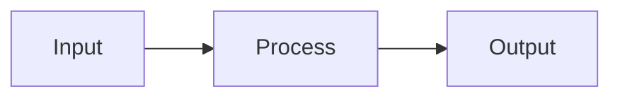

# {{title}}

## Definition

<!-- 2-4 sentences. What is this concept? Define it clearly for someone who's never heard of it. Avoid jargon in the definition — explain jargon when you introduce it later. -->

## Core Mechanism

<!-- How does it work? What are the moving parts? Use a diagram or equation if helpful.

-->

## Key Components

<!-- Break down the concept into its parts. One subsection per component. -->

### Component 1

### Component 2

### Component 3

## Why It Matters

<!-- What problem does this solve? What changed because of it? Why do people care? -->

## Current State

<!-- Where is this concept today? Mature? Emerging? Contested? What's the frontier? -->

## Open Questions

<!-- What's unresolved or debated? What don't we know yet? -->

- 
- 

## Common Misconceptions

<!-- Optional. What do people get wrong about this? -->

- **Myth**: 
  **Reality**: 

## History

<!-- Optional. Brief origin — who introduced it, when, in what context. -->

## Related Concepts

- [[]] — <!-- how it relates -->
- [[]] — <!-- how it relates -->

## Sources

- ^[raw/articles/source-file.md]
- ^[raw/videos/source-file.md]
